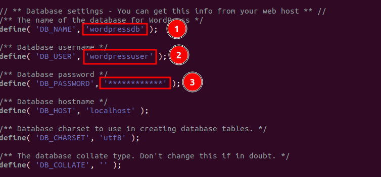

[WordPress](https://wordpress.com/) is one of the most popular content management systems (CMS) on the internet right now. It lets users set up flexible blogs and websites using a MySQL backend and PHP processing. At a very high rate, WordPress is used by both new and experienced engineers. It is a great choice for quickly getting a website up and running. After setting up WordPress for the first time, almost all website management can be done through its graphical interface. This and other features make WordPress a great choice for websites that are meant to grow. In this article I mentioned 4 Easy-to-follow steps for installing WordPress with LEMP on Ubuntu...

LEMP stack is a set of free software that helps web servers start up and run. The letters stand for the words Linux, Nginx, MySQL, and PHP. Arch Linux is already running on the server, so that part is taken care of.

## Prerequisites

- Super user or any normal user with SUDO privileges.
- apt repository configured to install the services.
- Already LEMP installed services. Please follow [this link](https://utho.com/docs/tutorial/how-to-install-lemp-on-ubuntu-18-04/) to install LEMP on Ubuntu

## 1 — Configure MySQL User for WordPress

WordPress uses MySQL to manage and store information about the site and its users. Even though MySQL is already set up, let's make a database and a user for WordPress to use.

If MySQL is set up to use the auth socket authentication plugin, which is the default, you can log in to the MySQL administrative account using below command.

```
# mysql -u root -p 
```

```
> CREATE DATABASE wordpressdb DEFAULT CHARACTER SET utf8 COLLATE utf8_unicode_ci;  
> CREATE USER 'wordpressuser'@'localhost' IDENTIFIED BY 'password';  
> GRANT ALL ON wordpressdb.* TO 'wordpressuser'@'localhost';
```

1. First, we've made a separate database that can be run by WordPress. You can call this whatever you want, but to keep things simple, we'll use "WordPressdb" in this guide.
2. Next, we have created a new MySQL user account that will only be used to work with our new database. From a management and security point of view, it's a good idea to make databases and accounts that only serve one purpose. We will call ourselves wordpressuser. Please ensure that you have used an alphanumeric password for this user.
3. Next, grant access wordpress user to the database you created. 

Now you can exit from mysql.

```
> exit 
```

## 2 — Install the Additional PHP Extensions.

When setting up the LEMP stack, PHP and MySQL could only talk to each other with a very small number of extensions. Many of WordPress's plugins use extra PHP extensions, and this tutorial will teach you how to use a few more.

Let's use WordPress to download and install some of the most popular PHP extensions by typing:

```
# apt update  
```
# apt install php-curl php-gd php-intl php-mbstring php-soap php-xml php-xmlrpc php-zip 
```

```

Now after successfully installing the php extension, just restart php-fpm services.

```
# systemctl restart php7.4-fpm 
```

## 3 — Configure Nginx

First of all, We need to put index.php as the first value of our index directive so that when a directory is requested, files named index.php are served if they are available.

```
# vi /etc/nginx/sites-enabled/default 
```

<figure>


<figcaption>

Make the index.php as first option

</figcaption>

</figure>

Now, let’s check our configuration for syntax errors by typing:

```
# nginx -t 
```

Now restart the nginx service.

```
# systemctl restart nginx 
```

## 4- Download and configure the Wordpress

Now that your server software is set up, let's get WordPress downloaded and set up. For security reasons, you should always get the latest version of WordPress directly from the project's website.

```
# wget wget https://wordpress.org/latest.zip 
```

> If you have no binary of wget( wget command not found ), then you can install by using
> 
> ```
# apt install wget -y 
```

And now extract the newly downloaded file by using tar command, most probably, it should be available on your server. Therefore to extract the file, use the below command.

```
# unzip latest 
```

> If you have no binary of unzip( unzip command not found ), then you can install by using
> 
> ```
# apt install unzip -y 
```

<figure>


<figcaption>

output after unziping the latest downloaded wordpress

</figcaption>

</figure>

<figure>


<figcaption>

latest created wordpress directory

</figcaption>

</figure>

After extracting the file, move this file's content to /var/www/html directory

```
# mv wordpress/* /var/www/html/
```

Next, give the webserver ownership of the WordPress files by giving the website directory the right permissions.

```
# chown -R www-data:www-data /var/www/html/  
```
# chmod -R 755 /var/www/html/
```

```

Now, go to the /var/www/html/ directory and copy wp-config-sample.php to wp-config.php. Also, make sure to get rid of the nginx index page that comes by default.

```
# cd /var/www/html  
```
# cp wp-config-sample.php wp-config.php 
```

```

Then, update the highlighted details with your database info in the MySQL settings section

```
# vi wp-config.php 
```

<figure>



<figcaption>

updating wp-config.php

</figcaption>

</figure>

Now, restart the nginx and mariadb services using the commands below:

```
# systemctl restart nginx mariadb 
```

Now go to you browser and enter your serverip

```
http://server-ip
```

<figure>


<figcaption>

Select the language in this page

</figcaption>

</figure>

With this article, I hope you now have a better understanding of how to install WordPress with LEMP on Ubuntu...
