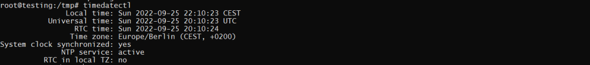

## Introduction

In this article you will know How to To Set or Change Timezone on Ubuntu 20.04. For many system-related tasks and processes, it is important to use the right time zone. For example, the cron daemon uses the timezone of the system to run cron jobs, and the timestamps in the log files are also based on the timezone of the system.

On Ubuntu, the time zone is set when the system is installed, but it is easy to change it later.

## Prerequisites

- A ubuntu server
- A Super user ( root ) or any normal user with [SUDO](https://en.wikipedia.org/wiki/Sudo) privileges.

## What is current timezone ?

The command-line programme timedatectl lets you see and change the system's time and date. It can be used on all modern Linux systems that use systemd, such as Ubuntu 20.04.

Run timedatectl with no arguments to see what time zone the system is in:

```
# timedatectl 
```

<figure>



<figcaption>

Output of timedatectl command

</figcaption>

</figure>

/etc/localtime is linked to a binary timezone identifier in the /usr/share/zoneinfo directory, which sets the system's timezone.  
You can also find the file that the symlink points to to see the current system's time zone:

```
# ls -l /etc/localtime
```

> Output:
> 
> lrwxrwxrwx 1 root root 33 May 10 2020 /etc/localtime -> /usr/share/zoneinfo/Europe/Berlin

In the /etc/timezone file, the timezone of the system is also written:

```
# cat /etc/timezone 
```

> Output:
> 
> Europe/Berlin

## Changing the time zone using the timedatectl command

You'll need to know the long name of the time zone you want to use before you can change it. "Region/City" is the format for the time zones.

You can either list the files in the /usr/share/zoneinfo directory or use the timedatectl command with the list-timezones option

```
# timedatectl list-timezones 
```

> Output:
> 
> .  
> .  
> .
> 
> Africa/Windhoek  
> America/Adak  
> America/Anchorage  
> America/Araguaina  
> America/Argentina/Buenos\_Aires  
> America/Argentina/Catamarca  
> America/Argentina/Cordoba  
> America/Argentina/Jujuy  
> America/Argentina/La\_Rioja  
> America/Argentina/Mendoza  
> America/Argentina/Rio\_Gallegos  
> America/Argentina/Salta  
> America/Argentina/San\_Juan  
> America/Argentina/San\_Luis  
> America/Argentina/Tucuman  
> America/Argentina/Ushuaia  
> America/Asuncion  
> America/Atikokan  
> America/Bahia  
> America/Bahia\_Banderas  
> America/Barbados  
> **_lines 1-40_**

Once you know the correct time zone for where you are, run the following command as the

```
# timedatectl set-timezone Asia/Kolkata 
```

Now again run the timedatectl command to ensure the changes.

```
# timedatectl 
```


Hopefully now you can Set or Change Timezone on Ubuntu 20.04

**Must Read :** [How to Install Hastebin on Ubuntu 20.04](https://utho.com/docs/tutorial/how-to-install-hastebin-on-ubuntu-20-04/)
