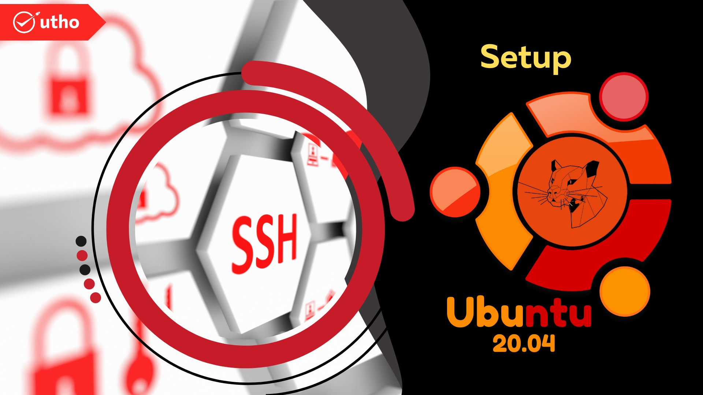

**Introduction**

In this article we will learn How to Set Up SSH Keys on Ubuntu 20.04....

[SSH](https://en.wikipedia.org/wiki/Secure_Shell) is an encrypted server administration and communication protocol. Most of your time with an Ubuntu server will be spent in an SSH terminal session.

In this guide, we'll set up Ubuntu 20.04 SSH keys. All users should use SSH keys to log into their server securely.

To Set Up SSH Keys on [Ubuntu 20.04](https://utho.com/docs/tutorial/2-methods-for-re-running-last-executed-commands-in-linux/) follow the below steps that will help you to increase your knowledge..

## Step-1. Putting together the Key Pair

First, create a key pair on the client (your computer):

```
#ssh-keygen
```

Recent versions of ssh-keygen create a 3072-bit RSA key pair by default, which is secure for most use cases (you may optionally pass in the -b 4096 flag to create a larger 4096-bit key).

You should see this after entering the command:

```
Output  
Generating public/private rsa key pair.  
Enter file in which to save the key (/your_home/.ssh/id_rsa):


```

Enter to save the key pair in your home directory's.ssh/ subdirectory, or specify another path.

If you have an SSH key pair, you may see this prompt:

```
 Output  
/home/your_home/.ssh/id_rsa already exists.  
Overwrite (y/n)? 
```

If you overwrite the disc key, you can't use the old key to authenticate. This is a destructive process that can't be undone.

You'll see a prompt:

```
Output  
Enter passphrase (empty for no passphrase):
```

Optionally, enter a secure passphrase here. A passphrase prevents unauthorised logins. How to Configure SSH Key-Based Authentication on a Linux Server for more security information.

Output should look like this:

```
 Output  
Your identification has been saved in /your_home/.ssh/id_rsa  
Your public key has been saved in /your_home/.ssh/id_rsa.pub  
The key fingerprint is:  
SHA256:/hk7MJ5n5aiqdfTVUZr+2Qt+qCiS7BIm5Iv0dxrc3ks user@host  
The key's randomart image is:  
+---[RSA 3072]----+  
| .|  
| + |  
| + |  
| . o . |  
|o S . o |  
| + o. .oo. .. .o|  
|o = oooooEo+ …o|  
|.. o _o+=._+o….|  
| =+=ooB=o…. |  
+----[SHA256]-----+
```

Now you have public and private keys to authenticate. Next, place the public key on your server so you can log in with SSH keys.

## Step-2 . Copies of the Public Key Being Saved to Your Ubuntu Server

To copy your public key to Ubuntu, use ssh-copy-id. Due to its simplicity, this method is recommended. If you don't have ssh-copy-id on your client machine, use one of the two methods below (copying via password-based SSH, or manually copying the key).

**Copying the Public Key Using** `ssh-copy-id`

ssh-copy-id is included by default in many operating systems, so it may be on your system. You must have password-protected SSH access to your server for this to work.

To use the tool, enter the remote host and SSH user account password. Your public SSH key will be copied to this account.

Syntax

```
 #ssh-copy-id username@remote_host
```

It is possible that you will see the following message:

```
 Output  
The authenticity of host '203.0.113.1 (203.0.113.1)' can't be established.

ECDSA key fingerprint is fd:fd:d4:f9:77:fe:73:84:e1:55:00:ad:d6:6d:22:fe.  
Are you sure you want to continue connecting (yes/no)? yes
```

Your computer doesn't recognise the remote host. First time connecting to a new host. Enter "yes" to proceed.

Next, the utility searches for the id rsa.pub key we created. When it finds the key, it requests the remote user's password.

```
 Output  
/usr/bin/ssh-copy-id: INFO: attempting to log in with the new key(s), to filter out any that are already installed  
/usr/bin/ssh-copy-id: INFO: 1 key(s) remain to be installed -- if you are prompted now it is to install the new keys  
username@203.0.113.1's password: 
```

Press ENTER after entering the password (your typing is hidden for security). The utility will use your password to connect to the remote host. It copies your /.ssh/id rsa.pub key to a file called authorized keys in the remote account's /.ssh directory.

This is the output:

```
 Output  
Number of key(s) added: 1

Now try logging into the machine, with: "ssh 'username@203.0.113.1'"  
and check to make sure that only the key(s) you wanted were added.
```

## Step.3 Copying the Public Key Using SSH

If you don't have ssh-copy-id but have password-based SSH access to a server account, you can upload keys using conventional SSH.

We can do this by using the cat command to read our local public SSH key and piping it to the remote server.

On the other hand, we can make sure our /.ssh directory exists and has the right permissions.

We can then output the piped content into a file called authorized keys. We'll use >> to append content instead of overwrite. This lets us add keys without deleting them.

Command is:

```
 #cat ~/.ssh/id_rsa.pub | ssh username@remote_host "mkdir -p ~/.ssh && touch ~/.ssh/authorized_keys && chmod -R go= ~/.ssh && cat >> ~/.ssh/authorized_keys"
```

```
 Output  
The authenticity of host '203.0.113.1 (203.0.113.1)' can't be established.  
ECDSA key fingerprint is fd:fd:d4:f9:77:fe:73:84:e1:55:00:ad:d6:6d:22:fe.  
Are you sure you want to continue connecting (yes/no)? yes
```

This means your computer can't see the remote host. When connecting to a new host, this happens. Press ENTER to continue.

After that, you'll be asked for the remote user password.

```
 Output  
username@203.0.113.1's password:
```

## Step.4 Making a Manual Copy of the Public Key

If you don't have password-based SSH access to your server, you must do the above manually.

We will manually append your id rsa.pub file to your remote machine's /.ssh/authorized keys file.

Type this into your computer to view id rsa.pub:

```
 #cat ~/.ssh/id_rsa.pub
```

```
 Output  
ssh-rsa AAAAB3NzaC1yc2EAAAADAQABAAACAQCqql6MzstZYh1TmWWv11q5O3pISj2ZFl9HgH1JLknLLx44+tXfJ7mIrKNxOOwxIxvcBF8PXSYvobFYEZjGIVCEAjrUzLiIxbyCoxVyle7Q+bqgZ8SeeM8wzytsY+dVGcBxF6N4JS+zVk5eMcV385gG3Y6ON3EG112n6d+SMXY0OEBIcO6x+PnUSGHrSgpBgX7Ks1r7xqFa7heJLLt2wWwkARptX7udSq05paBhcpB0pHtA1Rfz3K2B+ZVIpSDfki9UVKzT8JUmwW6NNzSgxUfQHGwnW7kj4jp4AT0VZk3ADw497M2G/12N0PPB5CnhHf7ovgy6nL1ikrygTKRFmNZISvAcywB9GVqNAVE+ZHDSCuURNsAInVzgYo9xgJDW8wUw2o8U77+xiFxgI5QSZX3Iq7YLMgeksaO4rBJEa54k8m5wEiEE1nUhLuJ0X/vh2xPff6SQ1BL/zkOhvJCACK6Vb15mDOeCSq54Cr7kvS46itMosi/uS66+PujOO+xt/2FWYepz6ZlN70bRly57Q06J+ZJoc9FfBCbCyYH7U/ASsmY095ywPsBo1XQ9PqhnN1/YOorJ068foQDNVpm146mUpILVxmq41Cj55YKHEazXGsdBIbXWhcrRf4G2fJLRcGUr9q8/lERo9oxRm5JFX6TCmj6kmiFqv+Ow9gI0x8GvaQ== demo@test
```

Once you have remote server access, make sure /.ssh exists. If the directory doesn't exist, this command creates it.

```
 mkdir -p ~/.ssh
```

Now you can create or edit the authorized keys file. Using this command, you can add your id rsa.pub file to the authorized keys file.

```
 echo public_key_string >> ~/.ssh/authorized_keys 
```

Substitute the cat /.ssh/id rsa.pub output in the above command. It's ssh-rsa. AAAA….

Finally, we'll set the permissions for /.ssh and authorized keys:

```
 chmod -R go= ~/.ssh 
```

This removes "group" and "other" permissions for /.ssh/.

If you're using root to set up user keys, make sure the /.ssh directory belongs to the user and not root:

```
 #chown -R microhost:microhost ~/.ssh 
```

In this tutorial, our user is sammy; substitute your own username.

Our Ubuntu server now supports passwordless login.

## Step-4 . Ubuntu SSH Key Authentication

After completing one of the above procedures, you should be able to log into the remote host without the password.

It's the same process.

```
 #ssh username@remote_host 
```

```
 Output  
The authenticity of host '203.0.113.1 (203.0.113.1)' can't be established.  
ECDSA key fingerprint is fd:fd:d4:f9:77:fe:73:84:e1:55:00:ad:d6:6d:22:fe.  
Are you sure you want to continue connecting (yes/no)? yes
```

Using password authentication will further secure your system if key-based authentication was successful.

## Step-5 . Server Password Authentication

If you can log into SSH without a password, you've successfully set up SSH-key-based authentication. However, password-based authentication is still active, leaving your server vulnerable to brute-force attacks.

Before completing this section, make sure SSH-key-based authentication is enabled for the root account or a non-root account with sudo privileges. This step locks password-based logins, so ensuring administrative access is key.

After confirming that your remote account has administrative privileges, log into your remote server with SSH keys as root or with sudo privileges. Then, open SSH's configuration file.

```
#sudo nano /etc/ssh/sshd_config
```

  
Search the file for PasswordAuthentication. This line can be #-commented out. Remove the # and set no on the line. This disables SSH password login.

```
 /etc/ssh/sshd_config  
. . .  
PasswordAuthentication no  
. . .
```

When finished, press CTRL+X, Y to confirm saving, and ENTER to exit nano. To activate the changes, restart sshd.

```
 #sudo systemctl restart ssh
```

Open a new terminal window to test SSH before closing your current session.

```
 #ssh username@remote_host
```

After verifying SSH's functionality, you can close all server sessions.

Ubuntu's SSH daemon only accepts SSH-key authentication. Disabled password logins.

I hope you have understood how to set up SSH keys on Ubuntu 20.04.

Must read :-

**Thankyou**
