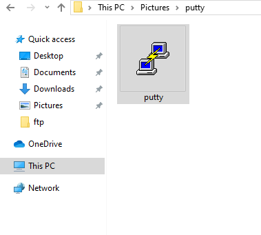
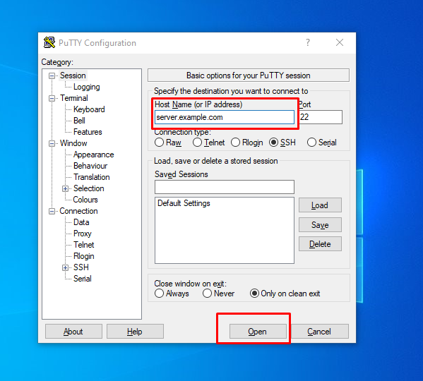
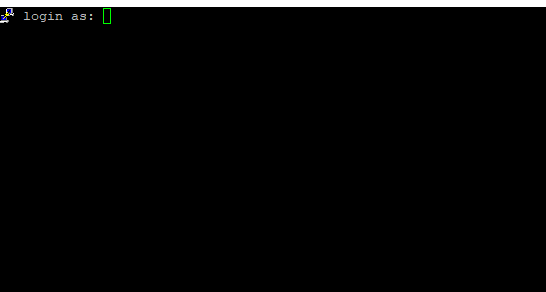
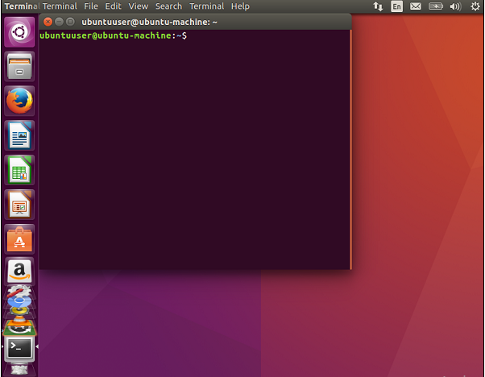

## Part 1: Access Linux server using SSH in Windows

1\. Download PuTTY or another PuTTY download source from URL [https://the.earth.li/~sgtatham/putty/latest/w64/putty.exe](https://the.earth.li/~sgtatham/putty/latest/w64/putty.exe) . The file called "putty.exe" is perfect for simple SSH.

2\. Save and download software in your Windows system.

3\. To launch the application, `double-click` the `putty.exe` file.



4\. Enter the settings of your connection



- Enter the `server ip` address or `hostname`.
- Port: 22 ( leave as default if SSH port is default)
- Connection Type: SSH (leave as default)

5\. Click Open to start the SSH session.

6\. If this is the first time you are connecting to the server on this computer, you will see the following output. Please accept the connection by clicking `Yes`.


7\. Once the SSH Connection has been opened, you should see the terminal prompt asking for your `username`:

<figure>



<figcaption>

**Connect to your preferred SSH user.**

</figcaption>

</figure>

8\. Next, please enter your `password`. Please note that you will NOT see your cursor moving or any typed characters (such as \* \* \* \* \* \*) when you type your password. This is a standard security feature of the PUTTY. Hit get in.

```
root@yourserver.example.com's password:
```

9\. You are logged in to your SSH server now. You will see output like this.

**root@yourserver.example.com's password:  
Last failed login: Sat Apr 25 17:03:02 IST 2020 from IP on ssh:notty  
There were 2 failed login attempts since the last successful login.  
Last login: Sat Apr 25 16:57:08 2020 from IP**  
**\[root@yourserver.example.com ~\]**

## Part 2: Access Linux server using SSH in Linux Ubuntu

1\. If you have ubuntu desktop. Go to Search bar and type "Terminal".


2\. Now terminal will open and you need to enter the following command on terminal.



```
# ssh username@yourserver.example.com
```

3\. You need to enter the password of SSH user of your server. ```
username@yourserver.example.com's password:
```

4\. Now you have connected your linux server on your ubuntu desktop using terminal and you will get outpout like this:

```
[root@yourserver.example.com ~]# 
```

## Part 2: Access Linux server using SSH in Mac OS

1\. If you have Mac OS. Go to Search bar and type "Terminal".


2\. Now terminal will open and you need to enter following command on terminal.


```
# ssh username@yourserver.example.com
```

3\. You need to enter the password of SSH user of your server. ```
username@yourserver.example.com's password:
```

4\. Now you have connected your linux server on your Mac OS using terminal and you will get outpout like this:

```
[root@yourserver.example.com ~]# 
```

Thank you...
