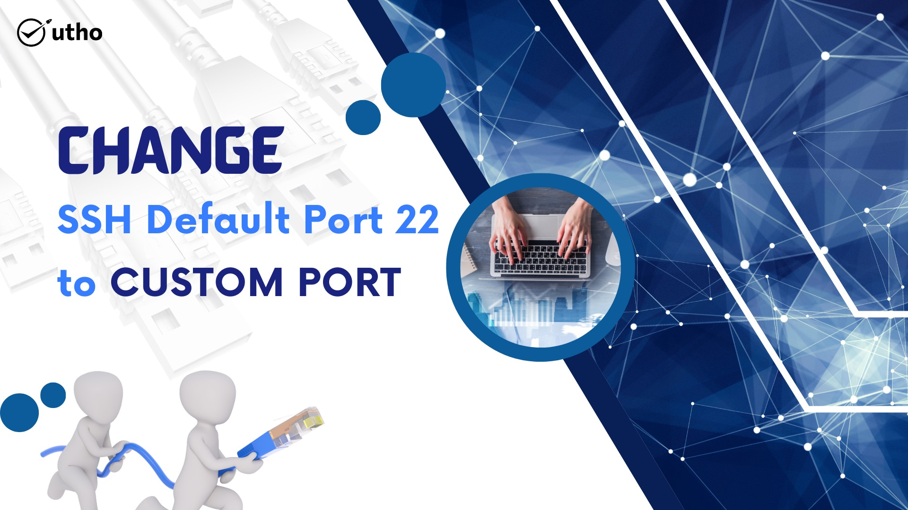
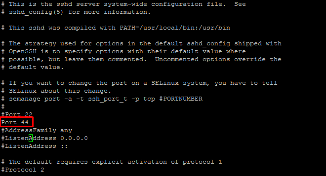

1\. Access your linux server using SSH with putty any third party software.


2\. Enter your sudo user password or root password.


3\. Open SSH configuration file using below command in your favorite editor.

```
 [root@ssh-port-change ~]# vi /etc/ssh/sshd_config 
```

4\. Add "Port 44" line in sshd\_config file and save or exit the file.



5\. Restart ssh service using below command.

```
 [root@ssh-port-change ~]# systemctl restart sshd 
```

6\. Open port 44 or custom port in firewall(Firewalld,CFS,IPtables,Microhost cloud firewall,etc) which you have defined in ssh configuration file,if you are using any internal and external firewall on server. For Eg:- firewalld

```
 [root@ssh-port-change ~]# firewall-cmd --add-port=44/tcp --permanent [root@ssh-port-change ~]# firewall-cmd --reload 
```

Thank you..
