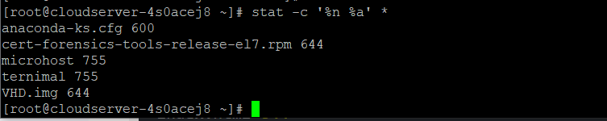

**Description**

You could find that displaying the access rights of files and directories in octal form rather to the more common rwx format is more helpful at times, or you might decide that you want to show both forms.

Stat is a software that shows the status of files or filesystems and is included in the majority of recent Linux distributions, if not all of them. This utility may be used in place of the good old ls -l command.

When called without any parameters but followed by the name of a specific file, the stat command will provide a significant amount of information on the directory or file. You are able to define an output format when using the stat command in conjunction with the -c option. This specific alternative is the one that piques our attention the most at the moment.

Type the following command to show all of the files in the current working directory, followed by their access privileges in octal format:

```
# stat -c '%n %a' * 
```



The following is the format sequence for the aforementioned command:

- %n denotes the file name.
- %a denotes access rights in octal form.

If you want to display the permissions in rwx format in addition, you have the alternative option of appending %a to %A, which is the parameter that is supplied to stat.

In that instance, simply type:

```
# stat -c '%n %A' * 
```


You can include the %F format sequence in order to see the file type shown in the output.

```
# stat -c '%c %F %a' 
```

You are able to specify a number of additional format sequences as well; for a full list of them, please refer to the stat man page.

```
# man stat 
```

**Conclusion**

We have gone over the essential Linux programme known as stat, which allows you to display the status of a file or file system. The conversion of the rwx access rights from the standard output of ls -l into octal format was the primary focus of our efforts here.

As I had indicated previously, many contemporary editions of Linux now come with the stat utility already installed. You should also keep in mind that your shell might already come pre-installed with its own version of stat. As a result, you should consult the documentation that comes packaged with your shell for additional information regarding the available options and how to make use of them.

**Thank You**
