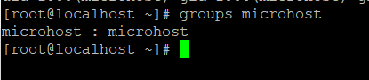
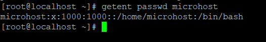
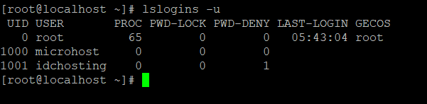
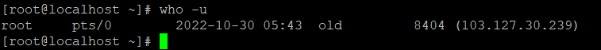

**Description**

In this article we will will learn Find multiple Ways to User Account Info and Login Details in [Linux](https://en.wikipedia.org/wiki/Linux)

This article will demonstrate multiple helpful methods that can be used to locate information regarding users on a Linux system. In this section, we will cover commands that can be used to retrieve information on a user's account, show login data, and find out what people are doing on the system.

If you wish to add users in Linux, use the useradd programme. If you want to alter or change any properties of a user account that has already been created, use the usermod utility using the command line as outlined in the following guides:

The commands that allow us to find a user's account information will be covered first, followed by an explanation of the commands that allow us to access login information.

Follow the below steps to Find multiple Ways to User Account Info and Login Details in [Linux](https://utho.com/docs/tutorial/2-methods-for-re-running-last-executed-commands-in-linux/)

## id Command

id is a straightforward command line application that displays accurate and useful user and group IDs in the format described below.

```
# id microhost 
```


## groups Command

This is an example of how the groups command may be used to display all of the groups to which a user belongs.

```
# groups microhost 
```



## getent Command

The getent tool is a command line programme that can retrieve entries from Name Service Switch (NSS) libraries that are stored in a particular system database.

Follow the steps below using the passwd database and the username to obtain information about a user's account.

```
# getent passwd microhost 
```



## grep Command

grep command is a strong example looking through device available on the vast majority Linux frameworks. You can utilize it to find data about a particular client from the framework accounts record:/etc/passwd as displayed underneath.

```
# grep -i microhost /etc/passwd 
```


## lslogins Command

lslogins command shows data about known users in the framework, the - u flag just shows user accounts.

```
# lslogins -u 
```



## users Command

The users command displays the usernames of any and all users who are currently logged on to the system in this format.

```
# users 
```


## who Command

The who command is used to display a list of users who are currently logged on to the system, along with the terminals from which they are connecting.

```
# who -u 
```



## w Command

The w command displays all users that are currently logged on to the system as well as the tasks that they are performing.

```
# w 
```


## last or lastb commands

The output of the last and lastb commands is a list of the most recently logged-in users on the system.

```
# last 
```

or

```
# last -a 
```


Use the -p option in the following way to display a list of all the users who were online at a particular time and date.

```
# last -ap now 
```

## lastlog Command

The lastlog command can be used to determine the particulars of a recent login for all users or for a specific user, as seen below:


```
# lastlog -u username 
```

On a Linux computer, we have discussed a variety of methods that can be used to locate information about users and login data.

This article shows several ways to find Linux user information. We'll discuss commands to get user account information, login data, and system activity in this section.

I really hope that you've got all of those steps down to Find multiple Ways to User Account Info and Login Details in Linux

Must Read :- https://utho.com/docs/tutorial/4-effective-ways-to-determine-the-name-of-a-plugged-usb-device-in-linux/

**Thank You**
