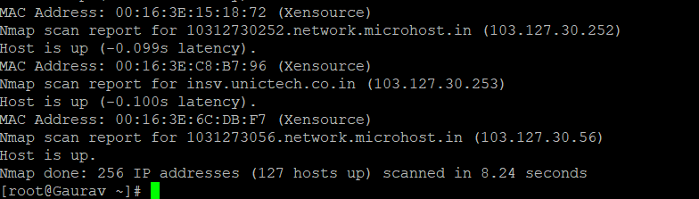

## **Description**

There are numerous network monitoring tools available in the [Linux](https://utho.com/docs/tutorial/category/linux-tutorial/) ecosystem that may create a summary of the overall number of devices on a network, including all of their IP addresses and other information.

However, sometimes all you need is a simple command line programme that can supply you with the same information with a single command.

This guide will show you how to find all live hosts' IP addresses that are linked to a specific network. We will use the Nmap utility to discover all IP addresses of devices connected to the same network.

[Nmap](https://nmap.org/) (short for Network Mapper) is an open source, powerful, and extremely versatile command line programme for exploring networks, performing security scans, network auditing, and discovering open ports on remote machines, among other things.

If you do not already have Nmap installed on your machine, use the corresponding command for your distribution below to install it:

```
 sudo yum install nmap -y 
```


- Once you've installed Nmap, here's how to use it:

```
# nmap [scan type…] options {target specification} 
```

Where hostnames, IP addresses, networks, and so on can be substituted for the parameter target specification.

To list the IP addresses of all hosts connected to a specific network, first identify the network and its subnet mask using the ifconfig or ip command, as shown below:

```
# ifconfig 
```

or

```
# ip addr show 
```


After that, do the following Nmap command:

```
# nmap -sn your nmap address/24
```



Within the preceding command:

- The type of scan is \-sn, which stands for ping scan. Nmap scans ports by default, however this scan disables port scanning.
- The target network is your nmap address/24; replace it with the IP address range of your own network.

Make an effort to read at the Nmap man page for complete instructions on how to use the programme:

```
# man nmap 
```

Alternately, to get a summary of the following use information, run Nmap without any options or arguments:

```
# nmap 
```

**Thank You**
