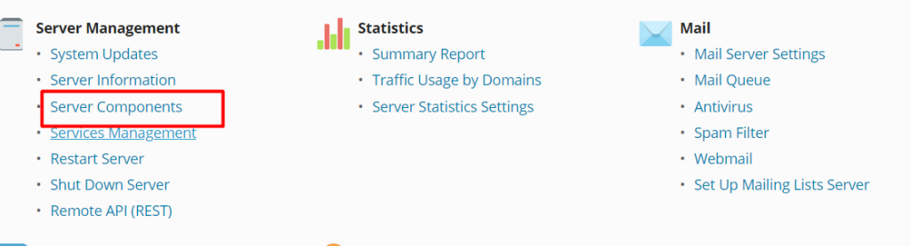

##### Introduction

In this article you will know about to find my Apache version in Plesk, In its capacity as a [Web server](https://utho.com/docs/tutorial/category/webserver-tutorial/), Apache is responsible for handling requests for directories sent in via the HTTP protocol from users of the Internet and delivering the requested information to those users in the form of files and Web pages. The majority of the software and code that powers the Web is created with Apache's features and functionality in mind.

**Plesk:** Plesk is a web hosting platform that comes with a control panel that enables the administrator to set up websites, reseller accounts, e-mail accounts, [DNS](https://en.wikipedia.org/wiki/Domain_Name_System), and databases using a web browser. Integration of support for content management systems (CMS) is included in Plesk. These content management systems include WordPress, Joomla, and Drupal, among others.

\*\***Follow the instructions below to check the version of Apache you are using.\*\***

**1.login to Plesk. Login to Plesk as an administrator**

**2.Click “Tools & Settings**

**3.Click erver Components**

**Check the component versions by following the instructions from above**.

## **1.login to Plesk. Login to Plesk as an administrator**

## 2.**Click “Tools & Settings**

## 3.**Click erver Components**

## **From this page, you can view all of the available versions and components.**

- When it comes to web hosting and website management, Plesk utilises web servers. Plesk for Linux makes use of the Apache HTTP Server (http://httpd.apache.org/), which is then paired with the nginx reverse proxy server so that it may achieve higher levels of performance. IIS is the HTTP Server that is used by Plesk for Windows

Why we utilise Plesk?  
Find more information about VPS Control Panels here. Web designers may construct websites, test them, and demonstrate the results to customers by using the Plesk control panel as a hosting platform to do so. It offers complete control over their server backup as well as the PHP settings, both of which are essential for a site administrator.

##### **Thank You**
