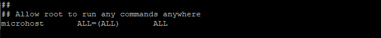

## Introduction

On CentOS 7, you will learn how to Add a [User](https://en.wikipedia.org/wiki/User) and Grant Root Privileges by reading the following article. One of the responsibilities of a system administrator is to be responsible for adding users and providing those users with administrative privileges. After a user has been added to CentOS and granted root access, that user will be able to log in to CentOS and carry out activities that are system-level in nature. After that, they will be able to execute tasks with elevated privileges by prefixing them with the sudo command. You will learn how to create a new user and give them administrative access by following the instructions in this concise guide.

A user group known as the "wheel" group is present in CentOS 7 when the operating system is first installed. The powers of sudo are automatically granted to anyone who is a member of the wheel group. Providing a user with sudo capabilities can be accomplished in a brisk and uncomplicated manner by just adding that user to this group.

## Step 1: I will add a user that is microhost.

```
# adduser microhost
```

## Step 2: Now set the password for the new user:

```
# passwd microhost
```


## Step 3: Grant Root Privileges to the User

```
# visudo
```

The above command takes us to the /etc/sudoers.tmp file, where we can see the code below:


You will add the line for your new user in the same format immediately following the line for the root user. Because of this, we will be able to provide that user administrative privileges.



To save your changes and quit the current file, press escape :wq.

If you have followed the procedures in the previous section, you should now have a user named microhost who has the ability to use sudo to run commands with root privileges.

Also read: [How To Install MariaDB 10.7 on CentOS 7](https://utho.com/docs/tutorial/how-to-install-mariadb-10-7-on-centos-7/)

Thank You 🙂
