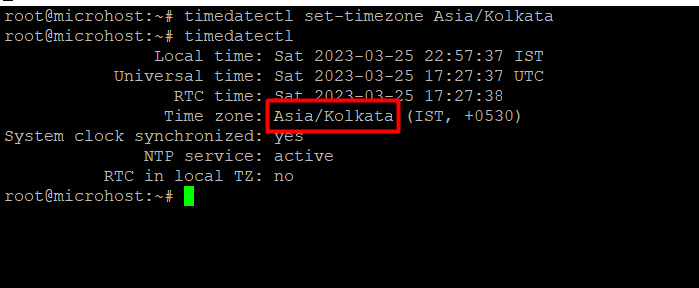
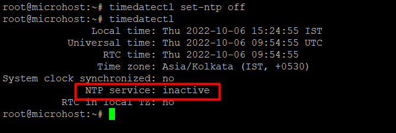

<figure>


<figcaption>

How to change date and time in Linux

</figcaption>

</figure>

**Description**

In this post, we will explore How to change date and time in [Linux](https://en.wikipedia.org/wiki/Linux) and the various options available to us in Linux for modifying the current date and time. On occasion, it is of the utmost need to ensure that the date and time on your [Linux](https://utho.com/docs/tutorial/linux-port-test-commandsredhat-7-centos-7-and-ubuntu-18-04/) server are accurate.

Follow the below steps to learn How to change date and time in Linux.

## Step.1  check current time and date

By using the timedatectl command that is provided below, you may get the current date and time.

```
timedatectl
```


## Step.2 Check available Time Zones

Using the timedatectl list-timezones command, which is demonstrated below, it is possible to examine all of the time zones that are currently accessible.

```
timedatectl list-timezones
```


## Step.3 Find only Asia Time Zone

As will be demonstrated in the following section, using the timedatectl list-timezones command, you can select only the time zones that you are interested in checking.

```
timedatectl list-timezones | grep -i Asia
```


Step.4 change timezone to Asia/Kolkata

You are able to alter the time zone at this point by utilising the timedatectl set-timezone command and specifying the appropriate time zone based on the output of the timedatectl list-timezones command, which can be found above.

```
timedatectl set-timezone Asia/Kolkata
```


## Step.5 change the time to 15:22:02

You can alter the time without affecting the date by using the timedatectl set-time command. This function is available in most modern operating systems.

```
timedatectl set-time '15:22:02'
```


## Step.6 Change the date to 6oct ,2022 and time to 15:22:02

You can adjust both the date and time by using the timedatectl set-time command, as described below.

```
timedatectl set-time '2022-10-06 15:22:02'
```


**Important**:- When you try to change the date and time manually, you may see the error "Failed to set time: Automatic time synchronisation is enabled." In that situation, you must disable the NTP before attempting to alter the date and time again.

```
timedatectl set-ntp off
```


I sincerely hope that each and every one of these things was clear to you. How to change date and time in Linux.

Must read :-
