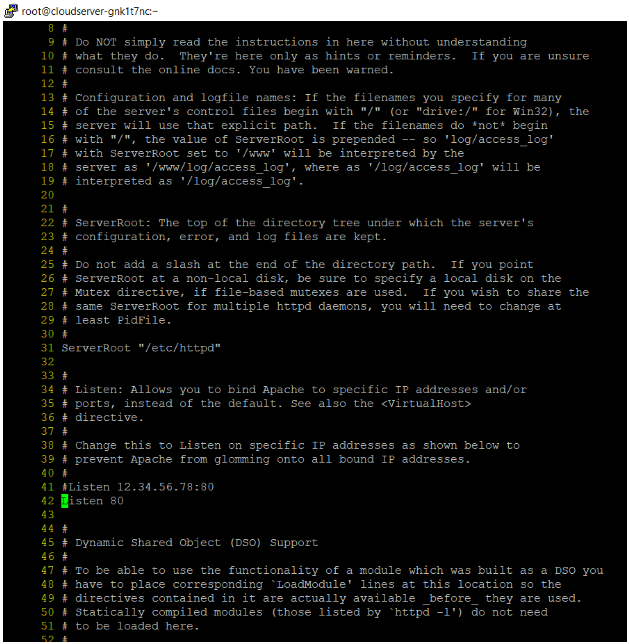

Apache HTTP server is one of the most widely used web servers on the internet today due to its versatility, reliability, and a plethora of capabilities, some of which are not available in competing web servers such as Nginx at the time.

Several of the most important features of Apache include the ability to load and run various types of modules and special configurations at runtime, without stopping the server or, worse, compiling the software each time a new module is added, and the unique role of.htaccess files, which can modify web server configurations specific to webroot directories.

Apache web server is configured by default to listen for incoming connections and bind to port 80. If you choose the TLS option, the server will listen on port 443 for secure communications.

**.. You must first run the following command to modify the 42 number line in the apache (httpd) file.  
**

```
#vi /etc/httpd/conf/httpd.conf
```



**#Listen 12.34.56.78:80  
**Listen 80 comment this line  
Listen 1234\*\*

.After adding the above line, you must build or modify an Apache virtual host on Debian/Ubuntu based distributions to begin the binding process.

In CentOS/RHEL, the update is made to the default virtual host. In the example below, we change the default virtual host of the web server from 80 to 1234.

Finally, restart the daemon and inspect the local network sockets table using netstat or ss. Your server's network table should show port 1234 as listening.  
```
#systemctl restart apache2
```  
```
#netstat -tlnp| grep apache
```  
```
#ss -tlpn| grep apache
```  
```
#Systemctl restart httpd
```

Simply navigate to your server's IP address or domain name on port 1234. The Apache default page should appear.

**\*\*[http://server\_ip:1234/](http://server_ip:1234/)**


