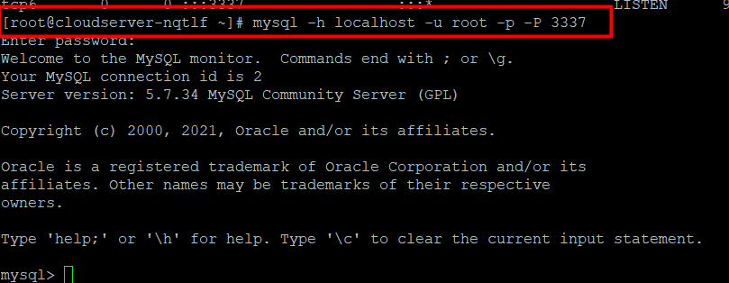

Default port of mysql is 3306 . To change the default port to custom port , Please follow the below step.

Step 1. First , use the below command to check the availability of port (port is free or not).

```
# netstat -tanp|grep 3337 
```  

Step 2. Open the mysql configuration file /etc/my.cnf.

```
# vi /etc/my.cnf 
```

Step 3 : In my.cnf find the \[mysqld\] section. Edit the port no. 3306 to 3337(or any) or if you do not find any such line you can add port = 3337 in my.cnf but it should be under the \[mysqld\] section as shown in the screenshot below .  
Press ‘i’ for the insert mode. 


Now save and exit from the file using (backspace) :wq

Step 4: Restart the mysql service.

```
# systemctl restart mysql service 
```

Step 5. To verify the port number of mysql , use the following command.

```
# netstat -tlpn | grep mysql 
```

Step 6. (Optional): If you have firewalld on your server , then open the required port by the following :

```
 # firewall-cmd –permanent –zone=public –add-port=3337/tcp  

```

Step 7. Login to mysql with custom port using following command.

```
 # mysql -h localhost -u root -p -P 3337 
```



Thank you!!
