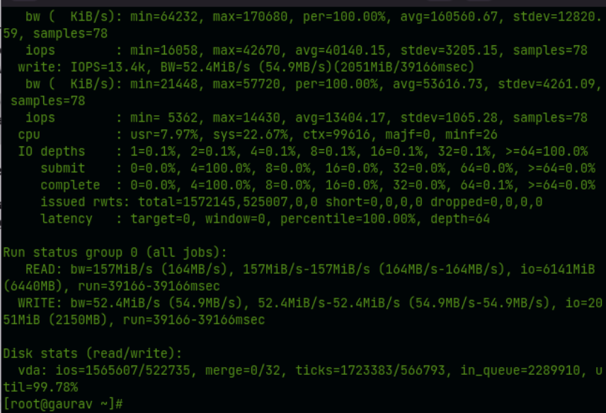
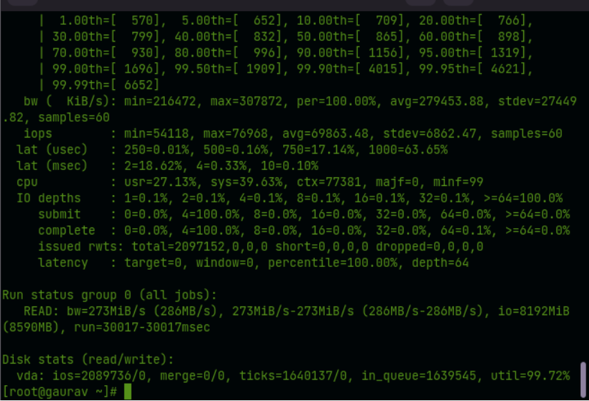

**Description**

We will learn how to Check Disk Performance (IOPS and Latency) in Linux?

Input/output operations per second (IOPS, pronounced "eye-ops") is a measure of how well computer storage devices like hard disc drives (HDD), solid state drives (SSD), and storage area networks (SAN) handle inputs and outputs (SAN).

[IOPS](https://en.wikipedia.org/wiki/IOPS) (input/output operations per second)

Read the below steps carefully to Check Disk Performance (IOPS and Latency) in linux.......

**Step.1**  
To measure disk [IOPS](https://utho.com/docs/tutorial/laravel-application-hosting-in-plesk/) performance in Linux, you can use the fio (the tool is available for RHEL in EPEL repository).So, to install fio in RHEL use the yum

```
#yum install epel-release -y
```


**Step.2**

```
#yum install fio -y
```


**Step.3**

**Random Read/Write Operation Test**

```
#fio --randrepeat=1 --ioengine=libaio --direct=1 --gtod_reduce=1 --name=fiotest --filename=testfio --bs=4k --iodepth=64 --size=8G --readwrite=randrw --rwmixread=75  

```



**Step.4**

**Random Read Operation Test**

Execute the following command in order to test the performance of the disc exclusively for random read operations:

```
#fio --randrepeat=1 --ioengine=libaio --direct=1 --gtod_reduce=1 --name=fiotest --filename=fiotest --bs=4k --iodepth=64 --size=8G --readwrite=randwrite  

```


**Step.5**  
And then you need to create file and always remember extension should be (.fio)

```
#vi microhost.fio  

```

And add the following contents into it:\[global\]  
rw=randread  
size=8G  
filename=/tmp/testfio  
ioengine=libaio  
iodepth=4  
invalidate=1  
direct=1  
\[bgread\]  
rw=randread  
iodepth=64

**Step.6**

Then start the test:  
```
#fio microhost.fio  

```



**Step.6**

To check disk latency in Linux, the ioping tool is used:

```
#yum install ioping -y  

```

**Run the latency test for your disk (20 requests are run):  
**

**Step.7**  
```
# ioping -c 20 /tmp/
```

**Moreinfo:-** Computer storage systems such as hard disc drives (HDD), solid state drives (SSD), and storage area networks (SAN) are evaluated based on a metric called input/output operations per second, also referred to as IOPS (pronounced "eye-ops") (SAN)

I hope you have a good understanding of how to check the performance of the disc (IOPS and latency) under Linux without any issues...

Must read:- [https://utho.com/docs/tutorial/how-to-make-a-linux-user-change-their-password-upon-login/](https://utho.com/docs/tutorial/how-to-make-a-linux-user-change-their-password-upon-login/)

**Thank You**
