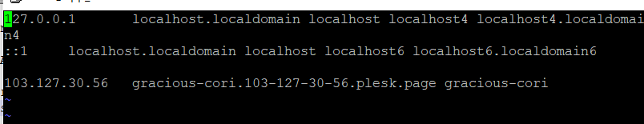

#### **Description**

A device or system hostname is a name given to a machine so that it may be identified inside a network using a format that is readable by humans. It shouldn't come as much of a surprise, but the hostname on a Linux system may be changed quickly and simply by using a simple command such as "hostname."

\*If you only run hostname by itself, without any other options, it will return the current hostname of your Linux system in the format shown here:

```
#hostname
```


To modify or alter the hostname of your Linux system, just type in:

```
#hostname dbserver
```


Naturally, you will need to change "new hostname" to the exact hostname that you want to configure once you have done so. This will instantly result in a change to the hostname of your system; however, there is a catch: the old hostname will be reinstated if you reboot your computer.

\*There is a different, permanent method available for altering the hostname of your machine. You could have already worked out that this would need changes to be made in certain configuration files, and if you did, you will be accurate in your assumption.

##### **Set System Hostname Permanently**

Systemd is a system and service manager that offers a hostnamectl command for managing hostnames in Linux. Newer versions of various Linux distributions, such as the most recent Ubuntu, Debian, CentOS, Fedora, and RedHat, come with systemd.

\*We will use the hostnamectl command to set the system hostname on distributions based on SystemD, as demonstrated in the example.

```
#sudo hostnamectl set-hostname any_name
```


The hostnames of older Linux distributions, such as those that utilise SysVinit instead of the shorter form init, may be altered by making a simple update to the hostname file, which is stored in:

```
#vi /etc/hostname
```

After that, you will need to add an additional entry for the hostname in:

```
#vi /etc/hosts
```



\*Change the value next to "HOSTNAME" to your hostname if you want to maintain a permanent hostname.

##### **Thank You**
