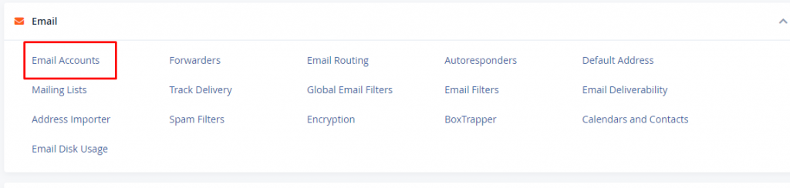

This post will show you how to set up an email account in cPanels. You don't have an email account set up by default. Although the main username appears to be set up as an email account, if you want to use it, you must add it as an email account.

1-Login to the cpanel.  
2- Go to the email section and click on the Email account.

3-Click the **\+ Create** button located on the right-hand side.

4-On the next page, enter the required details to create a new email account.

Domain: Select the domain where you wish to create the new email account.  
Username: Enter your email's username.  
Password: Enter your email's password.

5-You will notice the **Optional Settings**. Click the **Edit Settings** button to customize the new email account. This is where you can set your email's storage space.

6-Click **+ Create** to finalize.

The same steps work for creating email accounts for your primary domain, addon domains, and subdomains. You cannot create email accounts with a script or via SSH.

Thank you!!
