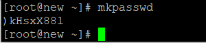
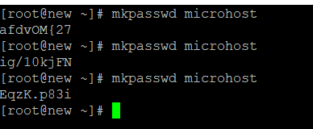

**Description**

In this article we will learn How to Create, Encrypt, and Decrypt Random Passwords in [Linux](https://en.wikipedia.org/wiki/Linux) In this essay, we will discuss how to create random passwords using Linux, as well as how to encrypt and decrypt passwords using either the slat approach or another way.

In this day and age of advanced digital technology, one of the primary problems that must be addressed is that of safety. We need to enter passwords in order to access a variety of items, including computers, email, the cloud, our phones, and numerous documents. The basics of picking a password that is easy to recall yet difficult to decipher are something that all of us are acquainted with. What about a machine-based password generator that takes care of everything for you and does it automatically? When I tell that Linux is extremely exceptional at achieving this, I ask that you trust me and accept my word for it.

Follo the below steps to How to Create, Encrypt, and Decrypt Random Passwords in [Linux](https://utho.com/docs/tutorial/change-ssh-default-port-22-to-custom-port/)..

1. Using the 'pwgen' command, generate a random, one-of-a-kind password with a length equal to ten characters. If you have not yet installed pwgen, you may download it by using either Apt or YUM.

```
# pwgen 10 1 
```


Produce a number of random and unique passwords with a length of 50 characters all in one go!

```
# pwgen 50 
```


You may use the'makepasswd' command to create a random, one-of-a-kind password of a specific length according to your preferences. Make sure that the makepasswd command has been installed on your system before you attempt to run it. If not! It is recommended that you use Apt or YUM to install the'makepasswd' package.

Produce a password that is completely random and has a length of 10 characters. Default Value is 10.

```
# mkpasswd 
```



Create a password that is completely random and has a length of 50 characters.

```
# mkpasswd 
```


Crypt, in conjunction with salt, should be used to encrypt a password. Salt should be made available both manually and automatically.

For the benefit of people who aren't familiar with salt:

Salt is a kind of random data that is used as an extra input to one-way functions with the purpose of preventing passwords from being cracked via dictionary attacks.

Before moving on, check to verify that the mkpasswd package has been successfully installed.

The password will be encrypted using salt if you run the command below. The value of the salt is determined in a manner that is both random and mechanical. Therefore, the output will be different each time you run the command below since it accepts a random value for salt each time. As a result of this, running the command below will always provide different results.

```
# mkpasswd microhost 
```



##### **Conclusion**

One of the key issues that must be addressed in this day and age of sophisticated digital technology is that of safety. Passwords are required to get access to a range of products, including computers, email, the cloud, smart phones, and various documents. We are all familiar with the principles of choosing a password that is simple to remember yet difficult to decode. What about a machine-based password generator that does everything for you automatically? When I say that Linux is very good at this, I ask that you believe me and take my word for it.

Must read [https://utho.com/docs/tutorial/convert-rwx-permissions-to-octal-format-in-linux/](https://utho.com/docs/tutorial/convert-rwx-permissions-to-octal-format-in-linux/):-

**Thank You**
