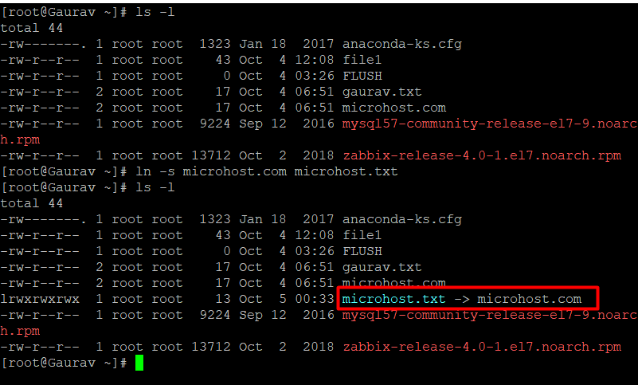

##### **Description**

In this Article we will discuss about how to create Hard and Symbolic Links, "Everything is a file" is the credo of [Unix](https://en.wikipedia.org/wiki/Unix)\-like operating systems like [Linux](https://utho.com/docs/tutorial/access-linux-server-using-ssh-in-windows-linux-and-mac-os/), and at its core, a file is nothing more than a link to an inode (a data structure that stores everything about a file apart from its name and actual content).

A file is said to have a hard link if it links to the same underlying inode as another file does. In the event that you delete one file, one link to the file's underlying inode will be removed. In contrast, a symbolic link, which may also be referred to as a soft link, is a link that points to the name of another file located inside the filesystem.

**Note:**The fact that hard links can only be used inside the same filesystem is another significant distinction between the two kinds of connections. Symbolic links, on the other hand, may be used across a variety of filesystems.

## **How to Create Hard Links**

```
#ls -l
```


\***Create hard link**

```
#ln source filename create hardlink file
```


## **How to Create Symbolic Links**

```
#ln -s source.file linkfile
```



\*ln creates hard links by default.  
\*-s creates a soft link.  
\*-f overwrites an existing file.

Source is the referenced file or directory.

If Destination is blank, the link is saved in the current working directory.

## **Deleting or Removing Links**

```
#rm linkfile name
```

```
#unlink linkfile name
```

**Hard Links vs. Soft Links**

The following are the two categories of connections that can be created with the ln command:

**Soft links**

**Hard Links**

**Soft( symbolik)Links**  
A soft link, also known as a symbolic link or symlink, directs users to the path or location of the original file. On the internet, it operates much like a hyperlink.

Here are some crucial features of a soft link:

The original data is still there even if the symbolic link file is removed.  
The symbolic link will not operate if the original file is relocated or removed.  
A file on a separate file system may be referenced using a soft link.  
To easily access a commonly used file without inputting the whole address, soft links are widely utilised.

**Hard Links**  
When a file is saved to a hard disc, the following occur:

The data is written physically to the disc.  
A reference file, calledinode, is generated to indicate where the data is stored.  
Creating a filename to relate to the inode data.  
A hard link operates by establishing a new filename that relates to the original file's inode data. In practise, this is equivalent to duplicating the file.

Here are few essential features of hard links:

If the original file is erased, the data of the file may still be accessible through hard links.  
If the original file is transferred, hard links continue to function.  
Only files on the same file system may be referenced by a hard link.  
When the number of hard links is zero, the inode and file contents are permanently erased.

**Thank You**
