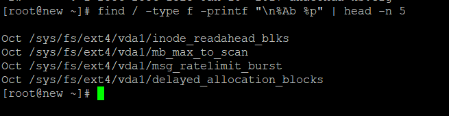

**Description**

On a regular basis, we make it a practise to save a significant amount of data on our system in the form of files. Some of them are hidden files, some are maintained in a different folder that was made just for our convenience, while others are left as they are. However, all of this information fills up our folders, most often the desktop, making it appear like a jumbled mess. But we run into an issue when we need to search this massive collection for a certain file that was edited at a specific date and time, and that file may be everywhere.

Those who are accustomed to working with graphical user interfaces (GUIs) can locate it by using File Manager, which lists files in a long listing format, which makes it simple to determine what we were looking for. On the other hand, users who are accustomed to working with black screens, as well as anyone who works on servers that do not have GUIs, would want a straightforward command or set of commands that could make their search simpler.

The true power and flexibility of Linux is on display here, as the operating system comes with a set of commands that, when utilised singly or in conjunction with one another, can assist in the search for a file or the sorting of a collection of files according to their name, date of modification, time of creation, or even any filter that can be imagined being applied in order to obtain the desired result.

In this section, we will demonstrate the true power of Linux by analysing a group of commands that may assist in the sorting of a file or even a series of files according to the date and time that they were created.

## **Sorting Files in Linux using Linux Utilities**

The following are some examples of fundamental Linux command line tools that are enough for sorting a directory according to the date and time:

**ls** command:- Listing the contents of the directory, this application may display the files and directories and can even provide all of the status information about them, such as the date and time of the most recent access or change, permissions, size, owner, and group, among other things.

## **sort command**

**sort**:- Using this command, you are able to sort the results of any search simply based on any field or any individual column of the field.

If you operate on dark screens and have to sort through a large number of files in order to get the one you want, you will find that these commands, in and of themselves, are quite powerful skills to acquire.

Various Methods for Classifying Documents Based on Date and Time

You can find a list of instructions to sort based on date and time below.

## **Create a list of files based on the most recent modification time.**

The following command will display the files in a long listing style and will order the files based on the most recent modification time. To sort in the other direction, use the '-r' option in conjunction with this command.

```
 # ls -lt 
```


## **List Files According to Last Access Time**

Listing of files in directory based on last access time, that is, listing of files based on the time the file was last accessed rather than the time the file was last edited.

```
 # ls -ltu 
```


## **List Files According to Last Modification Time**

The 'ctime' is a listing of files in the directory that is based on the most recent modification time of the file's status information. The first file that is shown by this command is the one whose status information, including the owner, group, permissions, and size, has been modified within the last several minutes.

```
 # ls -ltc 
```


With the '-a' choice, the above commands may list and sort even hidden files in the current directory, while the '-r' switch shows the result in reverse order.

For more in-depth sorting, such as sorting on the result of the search command, ls may also be used, but'sort' is more useful since the output may include more than just the file name.

The following lines demonstrate how to use the sort command in conjunction with the find command to sort a list of files based on Date and Time.

## **Sorting Files by Month**

In this case, we use the search command to locate all of the files in the root ('/') directory, and we then report the result in the following order: the month in which the file was accessed, followed by the filename.

```
# find / -type f -printf "n%Ab %p" | head -n 5 
```



The following command sorts the output with the key as the first field, as supplied by the '-k1' parameter, and then it sorts on the month, as specified by the 'M' parameter that comes before it.

```
# find / -type f -printf "n%Ab %p" | head -n 5 | sort -k1M


## **Sorting Files by Date**

Here, we use the search command once again to locate all of the files in the root directory; however, this time, we will output the results in the following order: filename, last date the file was accessed, and then last time the file was accessed.

[console]# find / -type f -printf "n%AD %AT %p" | head -n 5 
```


The sort command that follows first sorts on the basis of the last digit of the year, then sorts on the basis of the final digit of the month in the opposite order, and finally sorts on the basis of the first field. In this case, "1.8" refers to the eighth column of the first field, and the letter "n" that comes before it indicates that the data is being sorted numerically. The letter "r" indicates that the data is being sorted in reverse order.

```
# find / -type f -printf "n%AD %AT %p" | head -n 11 | sort -k1.8n -k1.1nr -k1 
```


## **Sorting Files by Date**

Here, we use the find command again to list the top 5 files in the root directory. The result is printed in the format "last time file was accessed, then filename."

```
# find / -type f -printf "n%AT %p" | head -n 11 
```


The following command arranges the data based on the first column of the first field, which is the first digit of the hour.

```
# find / -type f -printf "n%AT %p" | head -n 11 | sort -k1.1n 
```


## **Sorting ls -l output by date**

The output of the 'ls -l' command is sorted by this command based on the 6th field in the month-wise order, then based on the 7th field, which is the date, in the numerical order.

```
# ls -l | sort -k6M -k7n 
```


## **Conclusion**

In a similar vein, if you have a working grasp of the sort command, you may sort practically any listing according to any field, as well as any column of that listing. These are some tips that might assist you in sorting files depending on the date or time they were created. You are able to have your own own techniques built on top of them.
