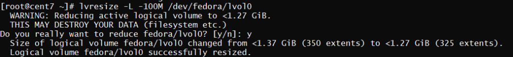

<figure>


<figcaption>

How to increase and decrease the LVM size

</figcaption>

</figure>

In this tutorial, you will learn how to increase and decrease the LVM size. But before learning the steps to do so, first understand what is LVM and how it works

## Description

LVM, which stands for "Logical Volume Management," is a framework in the Linux operating system that makes it easier to manage physical storage devices. Logical volume management is a lot like [virtualization](https://www.redhat.com/en/topics/virtualization/what-is-virtualization) in that you can set up as many virtual storage volumes as you want on top of a single storage device. The logical storage volumes that are made can be made bigger or smaller depending on how much storage you need.

For this feature to work, it's important to remember that the filesystem itself must support resizing. The EXT2, 3, and 4 filesystems all let you change the size of a filesystem both offline (when the filesystem is not mounted) and online (when the filesystem is mounted). You should look into the filesystems you want to use to see if they can be resized at all, and especially if they can be resized while you are online.

## Structure of LVM

Logical Volume Management lets you combine several hard drives and/or disc partitions into a single volume group (VG). Then, that volume group can be broken up into logical volumes (LV) or used as one big volume. Then, you can create regular file systems, like EXT3 or EXT4, on a logical volume.

<figure>


<figcaption>

LVM structure

</figcaption>

</figure>

## How to increase the LVM partition size

In this document, we are using one physical volume( /dev/sdb) from which we have created one volume group named as fedora( /dev/fedora). We have created one logical volume from fedora named as lvol0.

We have two methods by which we can increase the size of LVM partition.

1. lvextend command
2. lvresize command

### 1\. lvextend Method

If we are using this command, we need to run another command just to sync the inodes numbers to make the changes in effects.

Step 1.1 First let's see the status of the logical volume and volume group.

```
# lvdisplay 
```

<figure>


<figcaption>

lvdisplay output

</figcaption>

</figure>

```
# lvs 
```

<figure>


<figcaption>

status of logical volume

</figcaption>

</figure>

```
# vgs
```

<figure>


<figcaption>

volume group status

</figcaption>

</figure>

Now let's increase the size of the logical volume

```
 lvextend -L +200M /dev/fedora/lvol0 
```

<figure>


<figcaption>

extend the logical volume

</figcaption>

</figure>

Here in above command,

- \-L 1200 will increase the size of logical volume from 1000M to 1200M, please note that if you want to increase the size without knowing the final size, you can use -L +200M to increase the size of lvm by 200 mb.
- /dev/fedora/lvol0 is the logical volume, lvm, of which we want to increase the size.

Now if this logical volume has ext2/ ext3 or ext4 file system, they we will use resize2fs command. And if your lvm has xfs file system then you need to run **_xfs\_growfs_** to sync the inode table of the partitions.

```
# resize2fs /dev/fedora/lvol0 
```

<figure>


<figcaption>

sync the inode number

</figcaption>

</figure>

In this example we used ext4 file system. Therefore we used resize2fs command.

> Please note that, you can increase the size of lvm partition in either online mode or offline mode. But you cannot decrease the size of any lvm in online mode.

### 2\. lvresize Method

To resize the lvm partition by lvresize command you do not have to use any other command to sync the inode table.

```
 lvresize -L 1200M -r /dev/fedora/lvol0

<figure>


<figcaption>

resize the LVM size using lvresize

</figcaption>

</figure>

<figure>


<figcaption>

output of lsblk

</figcaption>

</figure>

## How to decrease the LVM partition size

- Suppored in only offline mode
- Xfs based FS cannot be reduced
- The above command of lvresize runs to reduce the size

<figure>


<figcaption>

status of Logical volume

</figcaption>

</figure>

[console]# lvresize -L -100M /dev/fedora/lvol0 
```

<figure>



<figcaption>

Decrease the Logical volume size

</figcaption>

</figure>

Now after doing everything, please check the size of the lvm partition.

```
# lsblk 
```

<figure>


<figcaption>

output of lsblk

</figcaption>

</figure>

or you can check the free space by using df command

```
# df -h 
```

In this tutorial, you have learnt how to increase and decrease the LVM size

Also Read: [How to install Drupal on Fedora](https://utho.com/docs/tutorial/how-to-install-drupal-on-fedora/), [How to install Cockpit on Ubuntu server](https://utho.com/docs/tutorial/How-to-install-Cockpit-on-Ubuntu-server/)
