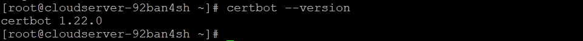

## Introduction

In this article, you will learn how to install Certbot on Fedora.

[Certbot](https://en.wikipedia.org/wiki/Let%27s_Encrypt) is a Python client that automates the process of obtaining free certificates from Let's Encrypt and configuring web servers to establish a secure https connection using these certificates. It does this by acquiring the certificates through Let's Encrypt.

As a starting point, we will look at the process of downloading Cerbot on Fedora, learn how to acquire a free certificate by utilising it, and automatically configure nginx and apache.

## Install Certbot on Fedora with nginx / apache

**In order to install certbot, we first need to install the epel-release repository (all of the following commands are performed with root privileges):**

```
# dnf install https://dl.fedoraproject.org/pub/epel/epel-release-latest-8.noarch.rpm --skip-broken

```

**Installing the client application and the package necessary for communicating with the server (using nginx as an example) is the next step.**

```
# dnf install certbot python3-certbot-nginx

```


**Install certbot along with the appropriate package if you are utilising Apache.**

```
# dnf install certbot python3-certbot-apache mod\_ssl

```

**The next step is to immediately acquire a free certificate and set up https configuration. If you are using nginx, run:**

```
# certbot --nginx

```

**If Apache is already installed on your system:**

```
# certbot --apache

```

**Run the following command to check the version of Certbot.**

```
# certbot --version

```



## Conclusion

Hopefully, now you have learned how to install Certbot on Fedora.

**Also Read:** [How to Use Iperf to Test Network Performance](https://utho.com/docs/tutorial/how-to-use-iperf-to-test-network-performance/)

Thank You 🙂
