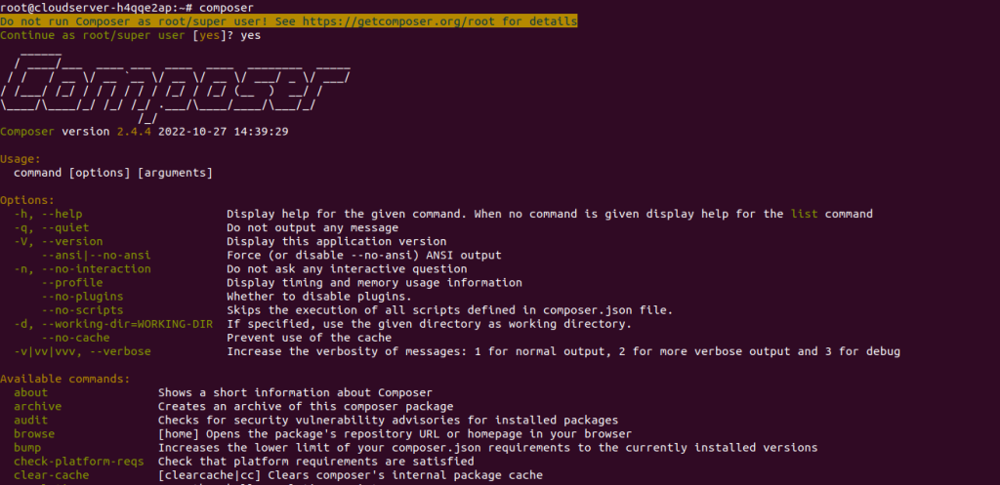

<figure>


<figcaption>

How to install Composer on Ubuntu

</figcaption>

</figure>

In this tutorial we will learn how to install Composer on Ubuntu 20.04 or on more latest version. [Composer](http://getcomposer.org) is a tool for taking care of PHP dependencies. It lets you list the libraries that your project needs, and it will install, update, and manage them for you.

Composer is not like Yum or Apt in that it is not a package manager. Yes, it works with "packages" or libraries, but it handles them per project and instals them in a directory (like "vendor") inside your project. It doesn't install anything everywhere by default. So, it is a manager of dependencies. It does, however, make it easy to work on a "global" project with the "global" command.

This is not a new idea, and node's npm and ruby's bundler were big influences on Composer.

## Prerequisites

- An Ubuntu server with APT repository configured
- Super user( root ) or any Normal user with SUDO privileges.

## 1 — Install Dependencies

First, make sure your package manager's cache is up to date and install the necessary dependencies, including php-cli:

```
# apt-get install update  
```
# apt install php-cli unzip 
```

```

## 2 — Download and Install Composer

Ensure you're in your home directory, and then use curl to download the Composer installer:

```
# curl -sS https://getcomposer.org/installer -o /tmp/composer-setup.php 
```

Next, we'll make sure that the installer we downloaded matches the latest installer's SHA-384 hash, which can be found on the Composer Public Keys / Signatures page.

Get the latest signature with curl and put it in a shell variable:

```
# HASH=``curl -sS https://composer.github.io/installer.sig`` 
```

Now, in order to check whether or not it is okay to run the installation script, execute the following PHP code:

```
# php -r "if (hash_file('SHA384', '/tmp/composer-setup.php') === '$HASH') { echo 'Installer verified'; } else { echo 'Installer corrupt'; unlink('composer-setup.php'); } echo PHP_EOL;" 
```

> Output:
> 
> Installer verified

The following command will download and install Composer as a system-wide command called composer in /usr/local/bin:

```
# php /tmp/composer-setup.php --install-dir=/usr/local/bin --filename=composer
```

<figure>


<figcaption>

output of above command

</figcaption>

</figure>

> Output:
> 
> All settings correct for using Composer  
> Downloading…  
> Composer (version 2.3.5) successfully installed to: /usr/local/bin/composer  
> Use it: php /usr/local/bin/composer

And now, if you want to verify your installation.

```
# composer 
```

<figure>



<figcaption>

Successful installation of Composer

</figcaption>

</figure>

And That is how you can install the Composer on the Ubuntu server

Also Read: [How to use Hugo](https://utho.com/docs/tutorial/how-to-use-hugo/), [How to Install Nginx and PHP-FastCGI on Fedora](https://utho.com/docs/tutorial/how-to-install-nginx-and-php-fastcgi-on-fedora/)
