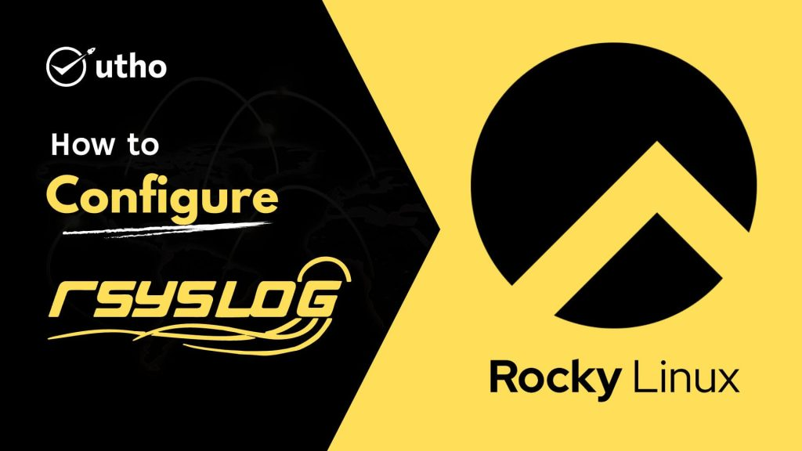

<figure>



<figcaption>

How to install Django on RockyLinux 8

</figcaption>

</figure>

In this document, we will learn how to install Django on RockyLinux 8. Django is a web framework written in Python that lets you make interactive websites and apps. With Django, it's easy to make Python web apps, and the framework takes care of a lot of the hard work for you.

It works quickly and is made to help developers get their apps up and running as soon as possible. Django helps developers avoid common security mistakes like SQL injection, XSS, CSRF, and clickjacking.

This guide will show you how to put Django on a server running RockyLinux. After you've installed it, you'll make a new project that will be the basis for your website.

PostgreSQL, MariaDB, MySQL, Oracle, and SQLite are the four main databases that Django supports. Other popular SQL and NoSQL databases are supported at different levels by community libraries. We recommend that you choose the same database for production and development, even though Django's Object-Relational Mapper brings out many of the differences in the database (ORM).

## Methods to install Django

There are different ways to install Django, depending on your needs and how you want to set up your development environment. There are pros and cons to each of these, and one might work better for you than the others.

Some of the different ways are:

- Global install from packages: The standard yum package manager in RockyLinux can be used to install Django packages from the official repositories. This is simple, but not very adaptable. It's also possible that the version in the repositories is behind the official project version.  
    

- In a virtual environment, you can install with pip: Using tools like venv and virtualenv, you can give each of your projects its own environment. With a virtual environment, you can put Django and other customizations and packages for the project in the project directory. Most of the time, this is the best and most practical way to work with Django.  
    

- To install the development version with git: If you want to install the latest development version, you can [get the code from the Git repository](https://github.com/django/django) instead of the stable release. This needs to be done in your virtual environment so that you can get the latest fixes and features. But development models aren't as stable as versions that have been tested more. (Not covered by this document)  
    

## Prerequisites:

- Any browser installed on your machine

- Super user or any normal user with SUDO privileges.

## Installation Steps:

## 1\. Global Install from Packages

If you want to use the yum repositories to set up Django, the process is very easy.

Step 1: First step is to install Epel-release:

```
yum install epel-release -y
```
Step 2: Now check the version of [Python you installed on your RockyLinux server](https://utho.com/docs/tutorial/python-3-installation-and-programming-environment-configuration-on-an-ubuntu-22-04/). You can see if it's true by:

```
python3 –V
```
Step 3: You can now put Django on your computer:

```
yum install python3-django
```
Step 4: You can make sure the installation is right by:

```
django-admin version
```
<figure>


<figcaption>

Django version

</figcaption>

</figure>

This means that the software will be installed correctly. You might also find that the version of Django you have is not the latest stable version.

## 2\. Install Django with pip in a Virtual Environment

Django can be installed on your system in a virtual environment in a flexible and easy way. We'll show you how to install Django in a virtual environment, which will be made with the venv module in the standard Python 3 library. With this tool, you can create a virtual Python environment and install Python packages without affecting the rest of the system. So, you can choose Python packages for each project, even if they conflict with the needs of other projects.

Step 2.1: First list the local package index:

```
yum repolist
```
Step 2.2: Check the version of Python that is installed:

```
python3 -V
```
Step 2.3: Now, install pip using the yum repositories:

```
yum install python3-pip python3-venv -y
```
Step 2.4: Now, whenever you start a new project, you can set up a virtual environment for it. Start by making a new project directory and moving it to the new one:

```
mkdir ~/testProject
cd ~/testProject
```
Step 2.5: Next, use the python command in the project directory to set up a virtual environment for your version of Python. We'll call my env as our virtual environment, but you should call it descriptive:

```
python3.8 - venv my_env
```
Step 2.6: This will install standalone versions of Python and pip in your project directory into a separate directory structure. The file hierarchy for where your packages will be installed will be put in a directory with the name you give it.

Packages can be install into the isolated environment by:

```
source my_env/bin/activate
```
<figure>


<figcaption>

Prompt after executing above command

</figcaption>

</figure>

Step 2.7: Your prompt should now say that your virtual environment is up and running. It will look like (my env)username@hostnamenewProject$.

You can add Django to your new environment with pip. No matter what version of Python you have, you should only call pip when you are in your virtual environment. Also, because you are installing locally, you won't need sudo:

```
pip install django
```
Keep in mind that this version may be different.

Step 2.8: To leave your virtual environment, you must send the deactivate command from anywhere on the system:

```
deactivate
```
## 3\. Creating a Sample Project with newly installed Django

With Django, you can start building your project. We will talk about how to make a project and test it on your development server using a virtual environment.

Step 3.1: After following the above steps, you jest need to follow the below steps to create a sample project with your newly installed Django

With startproject, you can use the _**django-admin**_ command to build your project. You could call this something else, but we're going to call our project djangoproject. In the working directory you already have, startproject will create a directory with:

```
(myEnv) $ django-admin startproject
```
Step 3.2: Using the manage.py command to migrate the database. Migration takes into account any changes you have made to your database schema in your Django models.

To move the database, you can:

```
(myEnv) $ python3.8 manage.py migrate
```

<figure>


<figcaption>

Migrate the database of Django project

</figcaption>

</figure>

Lastly, let's make an administrative user so you can use the Djano admin interface. Using the createsuperuser command, let's do this:

```
(myEnv) # python3.8 manage.py createsuperuser
```

You will be asked to give your user a user name, an email address, and a password.

## 4\. Changing the ALLOWED HOSTS setting in Django

You will need to change one of the directives in the Django settings in order to test your app.

Step 4.1: Type: to open the settings file.

```
vi ~/django-test/djangoproject/settings.py
```
Find the ALLOWED HOSTS directive inside. This sets up a list of addresses or domain names that can be used to connect to the Django instance. If a request comes in with a Host header that is not on this list, an exception will be thrown. Django needs you to set this so that a certain type of security hole doesn't happen.

Save the file and close the editor when you are done.

Step 4.2: Put the IP addresses or domain names that are connected to your Django server in the square brackets. Each item should be written in quotation marks, with a comma between each entry. Add a period to the beginning of the entry to get requests for the whole domain and any subdomains:

```
ALLOWED_HOSTS = ['your_server_ip_or_domain', 'your_second_ip_or_domain', . . .]
```

Step 4.3: Save the file and close the editor when you are done.

## 5\. Testing out the Development Server

Once you have a user, you can start up the Django development server to see what a new Django project looks like. You should only use this to build something. When you are ready to deploy, make sure to carefully follow Django's deployment instructions.

Step 5.1: Make sure that the right port is open in your firewall before you try the development server. If you set up your server according to the initial setup guide and are using UFW, you can open port 8000 by typing:

```
firewall-cmd --permanent --allow-port=8000/tcp
firewall-cmd --reload
```
Step 5.2: Start the development server:

```
(myEnv) # python3.8 manage.py migrate
```

<figure>


<figcaption>

Running Django project after installing Django successfully

</figcaption>

</figure>

Visit your server’s IP address followed by `:8000` in your favourite web browser:

You should see something that looks like the below screenshot:

Now, you have learnt how to install Django on RockyLinux 8
