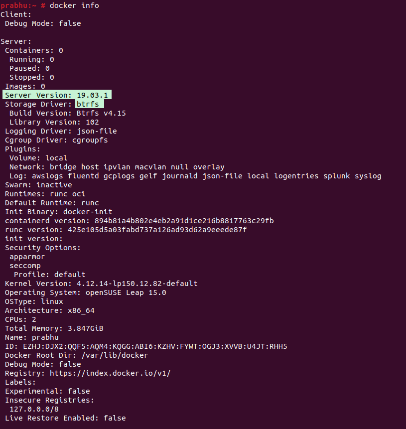

<figure>


<figcaption>

How to install Docker on Opensuse

</figcaption>

</figure>

In this article, you wil learn how to install Docker on OpenSUSE. [Docker](https://en.wikipedia.org/wiki/Docker_(software)) is a platform that is open source and allows developers to build, deploy, run, update, and manage containers. Containers are standardised, executable components that combine application source code with the [operating system](https://utho.com/docs/tutorial/how-to-host-a-domain-on-centos-7/) (OS) libraries and dependencies necessary to run that code in any environment. Docker enables developers to do all of these things.

Containers make it easier to design and deliver applications that run on distributed systems. As more and more businesses move their operations to cloud-native development and hybrid multicloud environments, their adoption rates have increased significantly. Developers have the ability to create containers even without the use of Docker by cooperating directly with features that are pre-installed in Linux and other operating systems. Docker, on the other hand, makes containerization more quickly, easily, and securely.

## Prerequisites

- Super user privileges or any normal user with SUDO privileges

- Internet enabled OpenSUSE server to install packages.

## Steps to install Docker on OpenSUSE

Step 1: The first step you need to do is get the repositories up to date. To accomplish this, use the following command:

```
zypper update
```
Step 2: After you have completed all of the necessary preparations, you may at long last go on to installing Docker on OpenSUSE by executing the following command.

```
zypper install -y docker
```


Step 3: Now, start the Docker services and enable to start the service automatically after every reboot.

```
systemctl enable --now docker
```
Step 4: Confirm the installation of the docker service on your machine.

```
docker info
```


Step 5: Run a test image on the docker to test the successfully installation.

```
docker run hello-world
```

