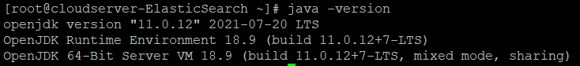
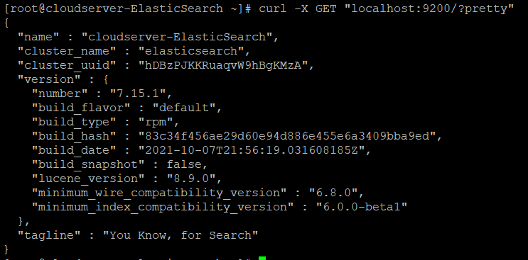

Elasticsearch is flexible and powerful open-source, distributed real-time search and analytics engine. Using a simple set of APIs provides the ability for full-text search.  
Elasticsearch is a search engine based on the Lucene library. It provides a distributed, multitenant-capable full-text search engine with an HTTP web interface.

Step 1.  Login to your server via SSH Putty


Step 2.  Installing/Checking java  
Java is the primary requirement for installing Elasticsearch on any system. You can check the installed version of Java by executing the following command:

```
 # java -version 
```

If it returns an error, install Java on your system by using the following commands one after another:

```
 # sudo dnf search openjdk 
```

```
 # sudo dnf install java-11-openjdk 
```

Now check the java version on your system.

```
 # java -version 
```



Step 3.  First of all, install GPG key for the elasticsearch rpm packages.

```
 # sudo rpm --import [https://artifacts.elastic.co/GPG-KEY-elasticsearch](https://artifacts.elastic.co/GPG-KEY-elasticsearch) 
```

Step 4.  Then create yum repository file for the elasticsearch. Edit /etc/yum.repos.d/elasticsearch.repo file:

```
 # sudo vi /etc/yum.repos.d/elasticsearch.repo 
```

Add below content to the file:

```file {title="/etc/yum.repos.d/elasticsearch.repo" lang="aconf"}
[Elasticsearch-7]

name=Elasticsearch repository for 7.xpackages

baseurl=[https://artifacts.elastic.co/packages/7.x/yum](https://artifacts.elastic.co/packages/7.x/yum)

gpgcheck=
gpgkey=[https://artifacts.elastic.co/GPG-KEY-elasticsearch](https://artifacts.elastic.co/GPG-KEY-elasticsearch)

enabled=
autorefresh=
type=rpm-md
```


Save and exit. (:wq)  

Step 5.  Install ElasticSearch by running the command:

```
 # sudo yum install elasticsearch 
```

Step 6.  After successful installation edit Elasticsearch configuration file “/etc/elasticsearch/elasticsearch.yml” and set the **network.host to localhost**.

```
 # vim /etc/elasticsearch/elasticsearch.yml 
```

Now set the network.host to localhost


Step 7.  Then enable the elasticsearch service and start it.

```
 # sudo systemctl enable elasticsearch 
```

```
 # sudo systemctl start elasticsearch 
```

Step 8.  The ElasticSearch has been successfully installed and running on your CentOS system.  

Run the following command to verify service:

```
 # curl -X GET "localhost:9200/?pretty" 
```

You will see results like below:  



ElasticSearch successfully installed.

Thank You
