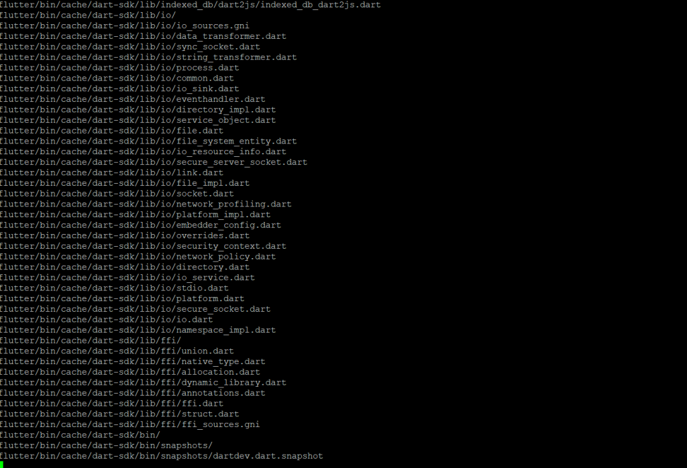
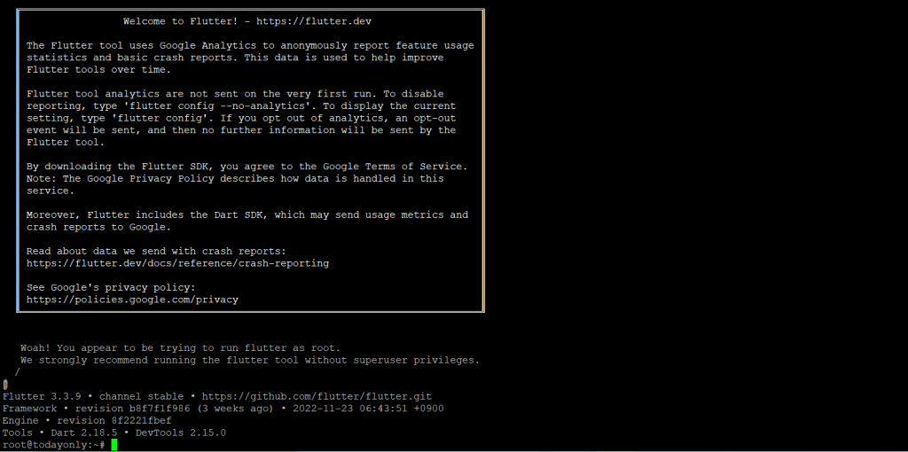

**Description**

In this article you will know how to Install Flutter on Ubuntu. Flutter is a Google open source framework used to create cross-platform applications for Android, iOS, Mac, Windows, and other platforms. Anyone picks this framework because it completely transforms the way application development occurs. You can now create, test, and develop outstanding mobile, desktop, web, and embedded apps from a single codebase.

## Prerequisites

a) You should have an Ubuntu 20.04 LTS server running.

b) To run privileged commands, you must have sudo or root access.

c) The snap, apt, wget, and tar programmes should be available on your server.

##  Update server

```
apt update
```
## Install Flutter

There are several methods for installing Flutter on Linux-based systems. We'll see the installation in two ways here. You can install using either of them.

## With Snapd

The snap install flutter —classic command, as displayed below, will install flutter if your system has the snap utility.

```
snap install flutter --classic
```


## With Tar File

You can find the latest version to download on the official download page. The most recent version for us right now is 2.8.1, so we use the wget command below to download this version.

```
wget https://storage.googleapis.com/flutter_infra_release/releases/stable/linux/flutter_linux_2.8.1-stable.tar.xz
```


Then, use the tar -xvf flutter linux 2.8.1-stable.tar.xz command to extract the package. This will extract the package into a local directory called "Flutter."

```
tar -xvf flutter_linux_2.8.1-stable.tar.xz
```


Then, use the command export PATH="$PATH:'pwd'/flutter/bin" to export the bin directory. Be aware that this is just a temporary export that won't work if you close your current session. So, if you want it to last, you should always export your path from /.profile or /.bashrc.

```
export PATH="$PATH:`pwd`/flutter/bin"
```
Using the flutter —version command, as shown below, you can check the installed version after a successful installation.

```
flutter --version
```


[Flutter](https://en.wikipedia.org/wiki/Flutter_(software)) is a Google open source framework used to create cross-platform applications for Android, iOS, Mac, Windows, and other platforms. Anyone picks this framework because it completely transforms the way application development occurs. You can now create, test, and develop outstanding mobile, desktop, web, and embedded apps from a single codebase.

Must Read : [Find multiple Ways to User Account Info and Login Details in Linux](https://utho.com/docs/tutorial/find-multiple-ways-to-user-account-info-and-login-details-in-linux/)

**Thankyou**
