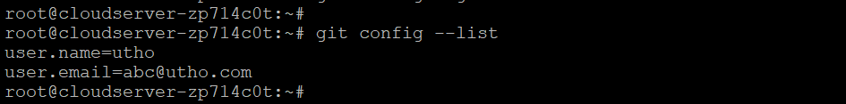

## Introduction

In this article, you will learn how to install Git on Debian 12.

**[Git](https://en.wikipedia.org/wiki/Git)** is free and open source software for distributed version control: tracking changes in any set of files, usually used for coordinating work among programmers collaboratively developing source code during software development. Its goals include speed, data integrity, and support for distributed, non-linear workflows (thousands of parallel branches running on different systems)

Git is used to track the history of changes made to a project and its associated files. Git keeps all of this data in a repository. All of a project's files and their respective revision histories are stored in a central location called a repository. Git is a version control system (VCS) that facilitates collaboration between programmers working on the same project by letting them monitor changes, roll back to a prior revision, and so on.

**Updating your system packages to the most recent version is recommended before getting started. The following command will update them all:**

```
# apt-get update -y

```

#### Install Git From Repository on Debian 12

**Installing Git from Debian's default repository is the quickest and easiest method. You should be aware that the repository version you install may be out of date compared to the most recent one.**

**You can install the Git by just running the following command:**

```
# apt-get install git -y

```

**Once the installation is complete, you can use the following command to confirm the version of Git that was downloaded and installed:**

```
# git --version

```


#### Setting Up Git

**The next step is to set up Git such that the commit messages it creates accurately reflect who you are.**

**In order to customize Git, you must provide your name and email address in the appropriate fields, as shown below:**

```
# git config --global user.name "utho"

```

```
# git config --global user.email "abc@utho.com"

```

#### Once Git has been set up, the setup can be tested with the following command:

```
# git config --list

```

**The following is an example of what you might see:**



**The above tutorial showed you how to compile Git from source code and install it from the Debian 10 repository.**

**To uninstall Git, type the following command into your terminal:**

```
# apt-get remove git -y

```

## Conclusion

Hopefully, you have learned how to install Git on Debian 12.

Also read: [How to Install TinyCP on Debian](https://utho.com/docs/tutorial/how-to-install-tinycp-on-debian/)

Thank You 🙂
