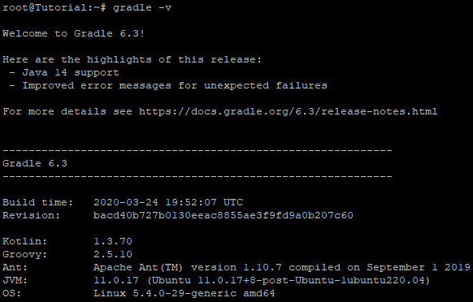

## Introduction

In this article, you will learn how to install Gradle on Ubuntu 20.04.

The build automation toolkit known as Gradle is available for free and under an open source license. It is modelled around [Apache](https://utho.com/docs/tutorial/how-to-host-a-domain-on-centos-7/) Ant and Apache Maven. A software project's full development lifecycle may be supported by the Gradle platform, which is provided by the tool.

## Step 1: System update

It is actually recommended that you update the system on the Ubuntu server instance you are using before installing any packages. To bring the system up to date, you will need to log in as the sudo user and then perform the following instructions.

```
# apt update
```

```
# apt install default-jdk -y
```

```
# java -version
```


## Step 2: Downloading Gradle

Downloading the [Gradle binary](https://en.wikipedia.org/wiki/Gradle) file requires the following wget command to be executed:

```
# wget https://services.gradle.org/distributions/gradle-6.3-bin.zip -P /tmp
```

When the download is finished, extract the contents of the zip file into the /opt/gradle directory as follows:

```
# unzip -d /opt/gradle /tmp/gradle-*.zip
```

Check to see whether the Gradle files were successfully extracted:

```
# ls /opt/gradle/gradle-*
```

```
output:
bin  init.d  lib  LICENSE  NOTICE  README
```

## Step 3: Setting up the Environment Variables

Next, we will need to ensure that the Gradle bin directory is included in the PATH environment variable by configuring it. To do this, use your preferred text editor and create a new file with the name gradle.sh inside the /etc/profile.d directory on your system.

```
# vi /etc/profile.d/gradle.sh
```

Paste the following configuration:

```
export GRADLE_HOME=/opt/gradle/gradle-6.3
export PATH=${GRADLE_HOME}/bin:${PATH}
```


Please save the file and then close it. During the initialization of the shell, this script will be sourced.

Executable permissions may be granted to the script by using the chmod command as follows:

```
# chmod +x /etc/profile.d/gradle.sh
```

Through the use of the source command, load the environment variables:

```
# source /etc/profile.d/gradle.sh
```

## Step 4: Verifying the Gradle Installation

Executing the following command, which will indicate the version of Gradle, will verify that the Gradle installation was performed correctly:

```
# gradle -v
```



## Conclusion

Hopefully, you have learned how to install Gradle on Ubuntu 20.04.

Thank You 🙂
