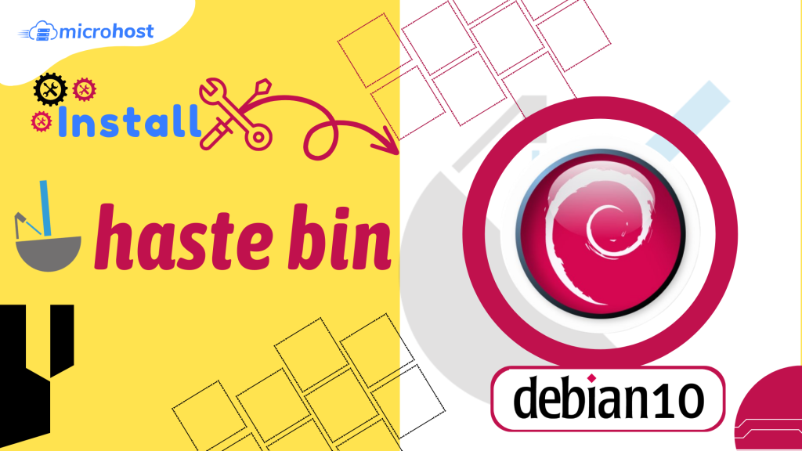

## Introduction

In this article, you will learn How to install Hastebin on Debian 10.

Hastebin is a web software with basic [Pastebin](https://en.wikipedia.org/wiki/Pastebin) and Hacker-style features that makes it simple to keep track of notes and snippets. Hastebin is a website that allows you to store and distribute little pieces of [text or code](https://utho.com/docs/tutorial/how-to-install-php-8-on-debian-10/). You can generate a new snippet, save the current one, and change any previously created ones with the help of the open-source service Hastebin. The Just Text option allows you to edit the sample in its native plain-text format. Once you've saved the snippet, you can send the link to other people who could benefit from it.

Hastebin uses Node.js for its server software. You can create and edit snippets via the online interface. The snippets can be uploaded to the server via the console by using the Hastebin command-line programme. Ruby is the language used to create Hastebin. Hastebin's designers aimed to make the service as easy as possible to set up and begin using.

## Setup Hastebin on Debian 10

Now that you know what Hastebin is, we'll show you how to get it up and running. First, run this command to update your system:

```
# apt update
```

It's time to get Snaps set up on Debian 10. Snaps are a type of software package that can run on any Linux distribution, are automatically updated, and roll back if necessary. Snapd can be activated by typing in the following command:

```
# apt install snapd -y
```

The snap core should now be installed using the following command:

```
# snap install core
```

Finally, the following command must be entered to set up Haste Server:

```
# snap install haste-server --beta
```

## Configure Hastebin on Debian

Now that Hastebin has been installed, the Debian setup process may begin. To begin, just swap ports (from 7777 to 80). Modifying the config.js file with your preferred text editor and the following command will allow you to alter the port:

```
# vi config.js
```

Then replace port 7777 with port 80:

```
"port": "7777",
"port": "80",
```

Then you should save the changes and close the text editor by escape :wq

Installing PM2 is the best option for Hastebin execution management. You can do this by typing in the following command:

```
# apt install npm
```

```
# npm install pm2 -g
```

To begin using Hastebin, type in the following command:

```
# pm2 start server.js
```

At this point, you need run the following command to save the default settings:

```
# pm2 save
```

**Note:** After executing the above command, the configuration file will be saved in the

**/root/.pm2/dump.pm2** directory.

Simply type in this command to have pm2 begin loading:

```
# pm2 startup
```

**If you're ready to give Hastebin a try, all you need to do is point your browser to HTTP: / your-server-address.**


## Conclusion

Hopefully you have learned how to install Hastebin on Debian 10.

Thank You 🙂
