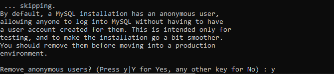

MySQL is an open-source relational database management system . Its name consists a combination of 'My' and 'SQL' as the name for the Structured Query Language of the co-founder Michael Widenius's daughter.

#### **Adding the MySQL Yum Repository**

\[ht\_message mstyle="alert" title="NOTE" " show\_icon="true" id="" class=""style="" \]These instructions are only used when MySQL is newly installed on the server.If you have already a MySQL installed using a third-party RPM package on the server , please upgrade or replace the installed MySQL Paket with the MySQL Yum Repository.

To download the latest version of MySQL, add the MySQL Yum repository to the repository list of your respective Linux distribution system.\[/ht\_message\]

```
 [root@Microhost ~]# wget https://dev.mysql.com/get/mysql57-community-release-el7-11.noarch.rpm 
```


You have downloaded the package with above command now for installation of those packages please use the following command:

```
 [root@Microhost ~]# yum localinstall mysql57-community-release-el7-11.noarch.rpm
```


By using the following command, you can verify that MySQL Yum has been successfully added.

```
 [root@Microhost ~]# yum repolist enabled | grep "mysql._-community._"
```


#### **Installing Latest MySQL Version**

Please use the following command for the installation of MySql server.

```
 [root@Microhost ~]# yum install mysql-community-server -y 
```


The MySQL has been successfully installed. We will start the service of MySQL with the following command.

```
 [root@Microhost ~]# systemctl start mysqld
```


We can check the status of MySQL with following command

```
 [root@Microhost ~]# systemctl status mysqld
```


#### **Securing the MySQL Installation**

Before proceeding further, we will copy the temporary password with the following command.

```
 [root@Microhost ~]# grep 'temporary password' /var/log/mysqld.log
```


We will copy this password as it will be used while changing the MySql password further.

The output will be shown as following:


We have to update a new password for MySQL root. Please update the complex password for security purposes.


You will get the prompt for changing the root password. You need to press "n" as per the screenshot.


Now , it will show the prompt of removal of anonymous users. You need to press "Y" as per the screenshot.



You will get the prompt for disabling the remote root login for security concerns. You need to press "y" as per the screenshot.


Further, you will be shown the prompt of removing the test database. You need to press "y" as per the screenshot.


At last , you will be shown the prompt of reloading the table privilege. You need to press "y" as per the screenshot.


We have done the configuration of Mysql . We can login with the root password using the below command:

```
 [root@Microhost ~]# mysql -u root -p 
```

We have successfully completed the installation and configuration of Mysql.

Thank You :)
