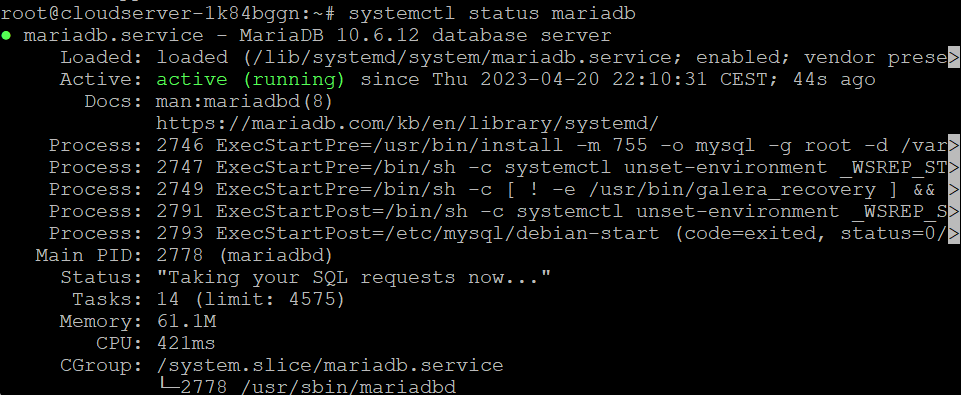
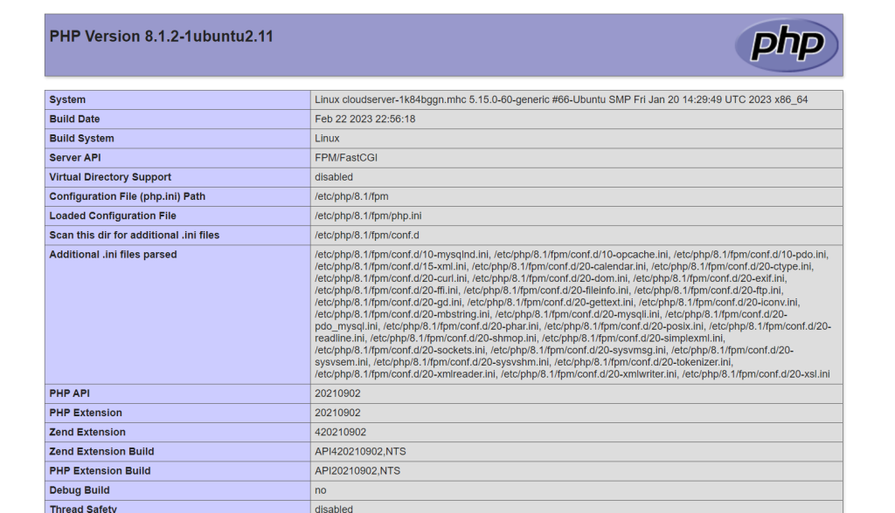

## Introduction

In this article, you will learn how to install LEMP on Ubuntu 22.04.

A software stack is a collection of software tools that are bundled together and [LEMP](https://en.wikipedia.org/wiki/Lemp) (Nginx, MariaDB, and PHP 8.1) is one such software stack. Linux, Nginx (Engine-X), MariaDB/MySQL, and PHP are all programmes that are open source and free to use. LEMP is an acronym for these programmes.

It is the software stack that is used most frequently to power dynamic websites and online apps.

The operating system that is being used is Linux.  
The web server that we use is called Nginx.  
The database server that we use is MariaDB/MySQL.  
The generation of dynamic web pages is accomplished through the use of the server-side programming language known as PHP.

## Step 1: Upgrade software packages

**Before we install the LEMP stack, we should run the following commands to update the repository and software files.**

```
# apt update

```

```
# apt upgrade -y

```

## Step 2: Install Nginx

**Nginx is a web server that works well and is used by a lot of people these days. It can also be used as a caching server and a reverse proxy. To set up Nginx Web server, type the following command.**

```
# apt install nginx

```

**By using the following command after the installation of Nginx, we can make it so that it starts automatically whenever the system boots up.**

```
# systemctl enable nginx

```

**Then start Nginx by typing in the following command:**

```
# systemctl start nginx

```

**Now check out its status.**

```
# systemctl status nginx

```


**Check the version of Nginx.**

```
# nginx -v

```


**Now, in the address box of your browser, type in the public IP address of the Ubuntu 22.04 server you are using. If you are able to view the "Welcome to Nginx" webpage, this indicates that the Nginx web server is functioning as expected.**


**There may be a firewall blocking inbound requests to TCP port 80, which would explain why the connection was either rejected or failed to finish. In order to make TCP port 80 available, you will need to execute the following command if your machine is protected by an iptables firewall.**

```
# iptables -I INPUT -p tcp --dport 80 -j ACCEPT

```

**If you are protecting your network with the UFW firewall, you will need to execute this command in order to open TCP port 80.**

```
# ufw allow http

```


**Last but not least, we have to change the owner of the web directory to be the Nginx user www-data. It is the responsibility of the root user by default.**

```
# chown www-data:www-data /usr/share/nginx/html -R

```

## Step 3: Install MariaDB

**MariaDB can be used in place of MySQL without any modification. It is being created by individuals who formerly worked on the MySQL team who are afraid that Oracle may decide to make MySQL a closed-source product. To install MariaDB on Ubuntu 22.04, type the following command into the terminal.**

```
# apt install mariadb-server mariadb-client -y

```

**You can use the command to check the version of MariaDB that is currently installed;**

```
# mysql -V

```


**Now, using the following command, check the current status of mariadb.**

```
# systemctl status mariadb

```



**Executing the following command will enable MariaDB to start automatically whenever the system boots.**

```
# systemctl enable mariadb

```

**Execute the post-installation security script at this time.**

```
# mysql\_secure\_installation

```

**Enter current password for root (enter for none): Press Enter**


**Switch to unix\_socket authentication \[Y/n\] : Press y**


**Change the root password? \[Y/n\] : Press y**


**Remove anonymous users? \[Y/n\] : Press y**


**If you choose you wish to let root login remotely, then press the y key; otherwise, press the n key.**


**Remove test database and access to it? \[Y/n\] Press y**


**Reload privilege tables now? \[Y/n\] : Press y**


**A username and password combination should be required in order to access the MariaDB shell.**

```
# mysql -u root -p

```


**To exit, run the following command**

```
# exit

```

## Step 4: Install PHP

**PHP8.1 is a component of the Ubuntu 22.04 repository and offers a marginal increase in overall performance when compared to PHP8.0. In order to install PHP 8.1 and some of the more common extensions, execute the following command.**

```
# apt install php8.1 php8.1-fpm php8.1-mysql php-common php8.1-cli php8.1-common php8.1-opcache php8.1-readline php8.1-mbstring php8.1-xml php8.1-gd php8.1-curl

```

**Installing these PHP extensions will ensure that your content management system operates without any problems. Now begin operating php8.1-fpm.**

```
# systemctl start php8.1-fpm

```

**Turn on the auto-start feature during boot up.**

```
# systemctl enable php8.1-fpm

```

**Verify the status of PHP:**

```
# systemctl status php8.1-fpm

```


## Step 5: Create a Nginx Server Block

**When working with Nginx, a server block is similar to a virtual host. We are not going to use the default server block because it is not capable of running PHP code and if we try to edit it, it turns into a tangled mess. Executing the following command will get rid of the default symlink that is located in the sites-enabled directory. (It's still available as /etc/nginx/sites-available/default.)**

```
# rm /etc/nginx/sites-enabled/default

```

**Then, build a new server block file in the directory located at /etc/nginx/conf.d/ using a text editor for the command line such as vi.**

```
# vi /etc/nginx/conf.d/default.conf

```

**Copy and paste the content that is provided below into the file. The code snippet that is presented below will cause Nginx to start listening on port 80 of IPv4 and port 80 of IPv6 with a catch-all server name.**

```
server {
  listen 80;
  listen [::]:80;
  server_name _;
  root /usr/share/nginx/html/;
  index index.php index.html index.htm index.nginx-debian.html;

  location / {
    try_files $uri $uri/ /index.php;
  }

  location ~ \.php$ {
    fastcgi_pass unix:/run/php/php8.1-fpm.sock;
    fastcgi_param SCRIPT_FILENAME $document_root$fastcgi_script_name;
    include fastcgi_params;
    include snippets/fastcgi-php.conf;
  }

 # A long browser cache lifetime can speed up repeat visits to your page
  location ~* \.(jpg|jpeg|gif|png|webp|svg|woff|woff2|ttf|css|js|ico|xml)$ {
       access_log        off;
       log_not_found     off;
       expires           360d;
  }

  # disable access to hidden files
  location ~ /\.ht {
      access_log off;
      log_not_found off;
      deny all;
  }
}
```

**Save and exit from the file by pressing escape :wq**

**Then test Nginx's settings.**

```
# nginx -t

```

**If the test works, you will need to reload Nginx.**

```
# systemctl reload nginx

```

## Step 6: Test PHP

**In order to test PHP-FPM with Nginx as a web server, we will need to create a file named info.php in the webroot directory.**

```
# vi /usr/share/nginx/html/info.php

```

**Copy and paste the PHP code that is shown below into the file.**

```
<?php phpinfo(); ?>

```

**Save and exit from the file by pressing escape :wq**

**Now, within the address bar of your web browser, type server-ip-address/info.php. Simply change sever-ip-address to your own real IP address.**

```
# server-ip-address/info.php

```



## Conclusion

Hopefully, now you have learned how to install LEMP on Ubuntu 22.04.

**Also Read:** [How to Use Iperf to Test Network Performance](https://utho.com/docs/tutorial/how-to-use-iperf-to-test-network-performance/)

Thank You 🙂
