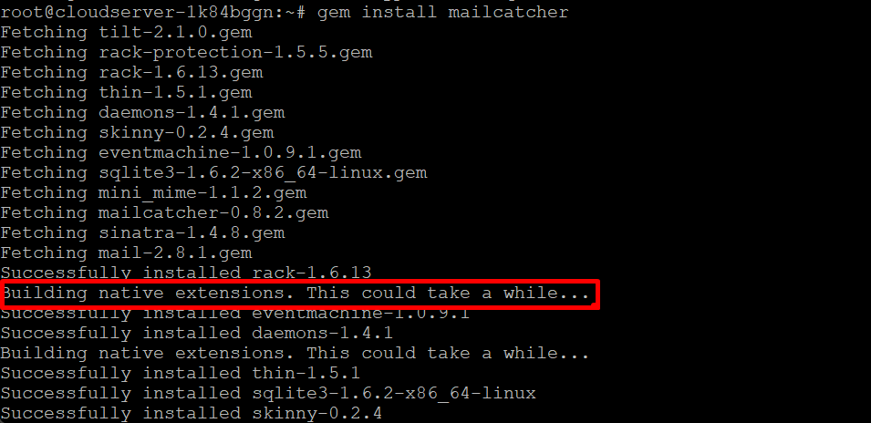

## Introduction

In this article, you will learn how to install MailCatcher On Ubuntu 22.04.

[MailCatcher](https://mailcatcher.me/) is a free programme that can monitor e-mails sent from any online or mobile application. It can do this by tracking the sender and the recipient of the messages. This programme acts as a fake Simple Mail Transfer Protocol (SMTP) server to which you can direct your messages rather than sending them to a real SMTP server.

It is important to keep in mind that emails sent in this manner will only be received by a local server and can be seen through a web interface. On the other hand, it's possible that these emails are simply never received.

## MailCatcher Features

Mailcatcher is able to assist you in conducting a comprehensive review of the contents as well as the titles of your email messages. You will be able to see the HTML version of an email and check to see if all of the headers, including the address for the Return-Path field, are correctly set using this tool. Before sending an email, you have the ability to test links, examine attachments, and pinpoint areas in which there is room for improvement.

Because using Mailcatcher is completely free, it might be appealing to you if you're operating on a very tight budget. Mailcatcher offers the capability to stop spam from reaching actual users of your application. You will have an easier time determining what actually works and what does not with the help of this tool.

## Installation

**Using the following commands, the first thing you need to do is install the dependencies that are necessary for installing Mailcatcher:**

```
# apt-get update

```


```
# apt-get install -y build-essential software-properties-common

```


```
# apt-get install -y libsqlite3-dev ruby-dev

```


**After that, in the next step, you will be able to quickly install MailCatcher by using the following command:**

```
# gem install mailcatcher

```



**Once you've followed the steps above to install MailCatcher, you're ready to get started.**

**Running the following command will start MailCatcher. Note that you need to enter your chosen IP address instead of Public IP address in the next command.**

```
# mailcatcher --ip <Public IP address>

```


**Now you can access your mailcatcher by browsing the following command in your browser:**

```
# http://server\_ip:1080

```


## Conclusion

Hopefully, now you have learned how to install MailCatcher On Ubuntu 22.04

**Also Read:** [How to install PHP 8.2 on Ubuntu 22.04](https://utho.com/docs/tutorial/how-to-install-php-8-2-on-ubuntu-22-04/)

Thank You 🙂
