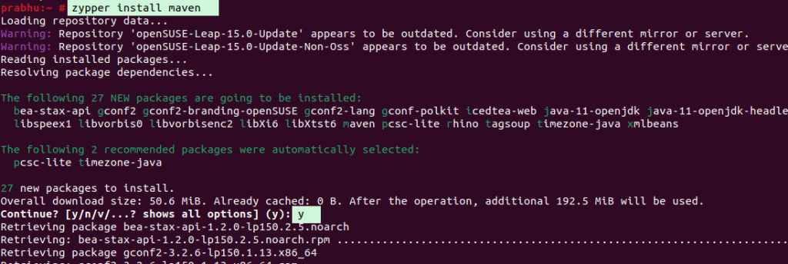

<figure>


<figcaption>

How to install Maven on Opensuse

</figcaption>

</figure>

In this article, you will learn how to install Maven on Debian 11 and Debian 10.

The Maven lesson explains both the basics and more advanced ideas of the [Apache Maven technology.](https://www.google.com/url?sa=t&rct=j&q=&esrc=s&source=web&cd=&cad=rja&uact=8&ved=2ahUKEwjP87-6l9P_AhVIU2wGHfL1DLsQFnoECDIQAQ&url=https%3A%2F%2Fen.wikipedia.org%2Fwiki%2FApache_Maven&usg=AOvVaw1q52GlNrBkmeyt339HXdqD&opi=89978449) Our maven lesson is made for both newbies and experts. Maven is a strong tool for managing projects. It is built on POM, which stands for "project object model." It is used to make, keep track of, and record projects. Like ANT, it makes the building process easier. But it's too far ahead of ANT.

## Prerequisites

- Super user or any normal user with SUDO privileges.

- An updated APT repositories to install java and maven.

- Java installed on server. If you have did not installed Java on your server, you can follow this guide- [How to install java.](https://utho.com/docs/tutorial/how-to-install-java-jdk-on-opensuse/)

## Steps to install Maven on OpenSUSE

Step 1: Add the required repo that is important to install the latest version of maven.

```
zypper addrepo https://download.opensuse.org/repositories/home:alvistack/openSUSE_Tumbleweed/home:alvistack.repo
```
<figure>


<figcaption>

Add the repositories on server

</figcaption>

</figure>

Step 2: Refresh the zypper repositories to update the changes.

```
zypper refresh
```
<figure>


<figcaption>

Trust the signing key

</figcaption>

</figure>

Step 3: Install the Maven on your server using the below command.

```
zypper install maven -y
```
<figure>



<figcaption>

Install the maven on opensuse

</figcaption>

</figure>

And this is how you have learnt how to install Maven on OpenSUSE.
