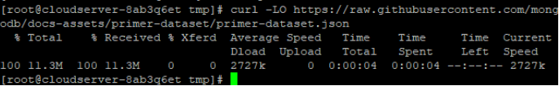
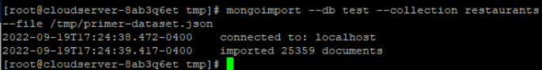

## Introduction

In this article, you will learn how to install MongoDB on CentOS.

MongoDB is a non-relational document database that provides support for [JSON](https://aws.amazon.com/documentdb/what-is-json/)\-like storage. The MongoDB database has a flexible data model that enables you to store unstructured data, and it provides full indexing support, and replication with rich and intuitive APIs.

## **Step 1 – Adding the MongoDB Repository**

The CentOS default repositories do not contain the mongodb-org package. MongoDB does, however, keep a separate repository. Add it to our server now.

Create a.repo file for yum, the package management utility for CentOS, using the vi editor by following these steps:

```
# vi /etc/yum.repos.d/mongodb-org.repo
```

Then add the following context in file:

\[filecode\]\[mongodb-org-3.4\]

name=MongoDB Repository

baseurl=[https://repo.mongodb.org/yum/redhat/$releasever/mongodb-org/3.4/x86\_64/](https://repo.mongodb.org/yum/redhat/$releasever/mongodb-org/3.4/x86_64/)

gpgcheck=1

enabled=1

gpgkey=https://www.mongodb.org/static/pgp/server-3.4.asc\[/filecode\]

Save the file by escape colon wq

Before we continue, we need to make sure that the yum utility contains a MongoDB repository. If it does, then we can carry on. The repolist command will give a list of the repositories that are currently enabled:

```
# yum repolist
```


With the MongoDB Repository in place, let’s proceed with the installation.

## ****Step 2 – Installing MongoDB****

We can install the mongodb-org package from the third-party repository using the yum utility.

```
# yum install mongodb-org -y
```

```
# systemctl start mongod
```

```
# systemctl status mongod
```


After performing the start command, the systemctl utility did not produce a result; however, we can verify that the service started by examining the mongod.log file using the tail command and looking at the end of the file:

```
# sudo tail /var/log/mongodb/mongod.log
```


The database server, MongoDB, has started properly if the line waiting for a connection appears in the output of the MongoDB Shell:

```
# mango
```

The db.help() method returns a set of methods for the db object, which can be used to understand how to interact with MongoDB from the shell.

```
# db.help()
```


While exiting the shell, leave the mongod process running in the background:

```
# exit
```

## **Step 3 – Verifying Startup**

Because a database-driven application can't work without a database, we'll make sure that the MongoDB daemon, mongod, starts up with the system.

Check its startup status with the systemctl command:

```
# systemctl is-enabled mongod; echo $?
```


A result of 0 means that the daemon is running, which is what we want. A one, on the other hand, means that the daemon is disabled and will not start.

If a daemon is turned off, use the systemctl command to turn it on:

```
# sudo systemctl enable mongod
```

We now have an instance of MongoDB that is running and will start up automatically when the system reboots.

## **Step 4 – Importing an Example Dataset (Optional)**

There is no sample data available in the MongoDB test database like there is in other database servers. Instead of risking the integrity of our production data by testing out new software on it, we'll import a sample dataset from the "Getting Started with MongoDB" documentation's "Import Example Dataset" section. To get comfortable with working with MongoDB without risking any important information, we'll be practicing on a JSON document containing a list of restaurants.

To begin, please change to a directory that can be modified:

```
# cd /tmp
```

To obtain the JSON file, simply use the curl command and the corresponding link from MongoDB:

```
# curl -LO [https://raw.githubusercontent.com/mongodb/docs-assets/primer-dataset/primer-dataset.json](https://raw.githubusercontent.com/mongodb/docs-assets/primer-dataset/primer-dataset.json)
```



The data will be imported into the demo database using the mongoimport command. Using the —db parameter, you can provide the database to use; the —collection flag can define the collection within the database; and the —file flag can specify the file to import from.

```
# mongoimport --db test --collection restaurants --file /tmp/primer-dataset.json
```



Following the installation of the sample dataset, we will carry out a query on it.

Relaunch the MongoDB Shell:

```
#  mongo
```

By default, the shell will use the test database, which is where we transferred our information.

To see a complete listing of the restaurants in the dataset, we can use the find() method to query the restaurants collection. Since there are more than 25,000 items in the collection, you can use the limit() method to restrict the results to a smaller size. By inserting newlines and indents, the pretty() technique also improves readability.

```
# db.restaurants.find().limit( 1 ).pretty()
```


You can either keep working with the example data to learn more about MongoDB, or you can remove it entirely with the db.restaurants.drop() command.

```
# db.restaurants.drop()
```


Finally, use the exit command to exit the shell:

```
# exit
```


## Conclusion

Hopefully, now you have learned how to install MongoDB on CentOS.

Also read: [How To Install MariaDB 10.7 on CentOS 7](https://utho.com/docs/tutorial/how-to-install-mariadb-10-7-on-centos-7/)

Thank You 🙂
