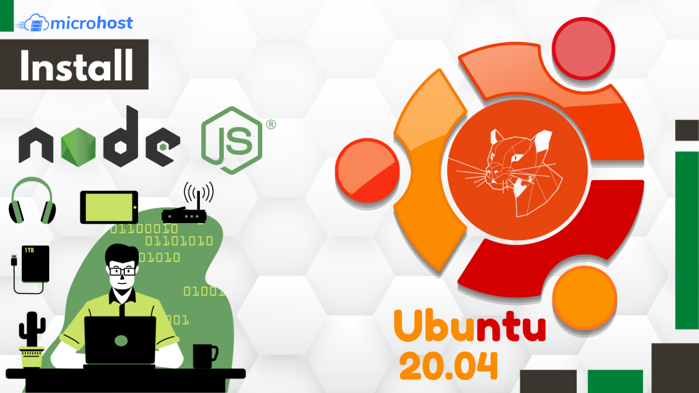
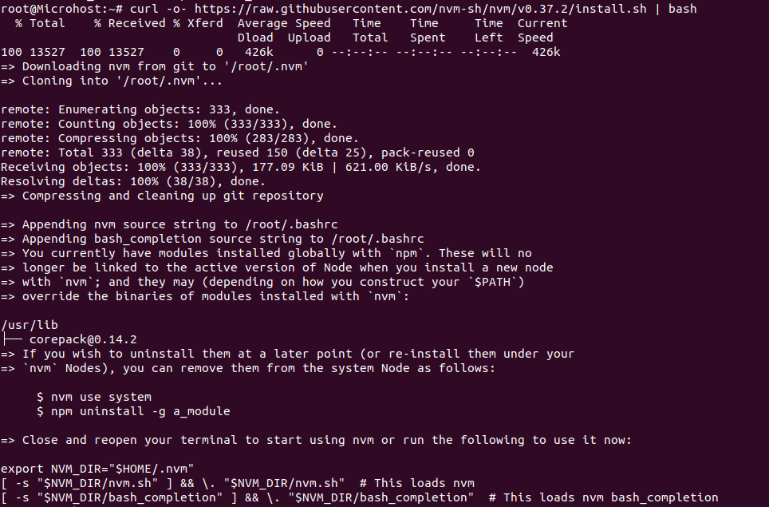
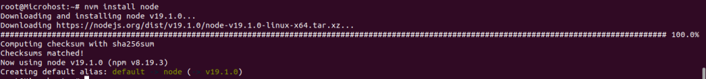

<figure>



<figcaption>

How to Install Node.js and npm on Ubuntu 20.04

</figcaption>

</figure>

This tutorial is to learn the method of how to Install Node.js and npm on Ubuntu 20.04. Based on Chrome's [V8](https://v8.dev/) JavaScript engine, Node.js is an open-source, cross-platform JavaScript runtime environment. It is typically used for conventional web pages and back-end API services and is built for non-blocking, event-driven servers. You can rapidly create network apps thanks to it. By using JavaScript on both the front and backend, it improves development consistency. The Node.js registry and package management is called npm. It is used to create, distribute, find, and install node applications.

In this article, we will show you a few different ways to install Node.js and npm on an Ubuntu 20.04 server.

## Prerequisites

- Apt repository ready and available to install packages
- Super user or any normal user with SUDO privileges

## 1\. Install Node.js and npm from Ubuntu Repository

Node.js and npm may be installed from the Ubuntu default repository in the simplest and most convenient method possible. It does not, however, include the most recent Node.js version. The most recent Node.js version that is compatible with [Ubuntu](https://utho.com/docs/tutorial/how-to-install-webmin-on-ubuntu-20-04/) 20.04 at the time this guide was written is 10.19.0.

First, execute the following command to update the system packages:

```
apt-get update -y
```
Use the following command to install Node.js and npm after all the packages have been updated:

```
apt-get install nodejs npm -y
```
Once both packages are installed, verify the Node.js and npm version using the following command:

```
node -v
```
<figure>


<figcaption>

installed versions of nodejs and npm

</figcaption>

</figure>

## 2\. Install Node.js and npm from NodeSource

Numerous Node.js versions are available in the APT repository that is maintained by NodeSource. You may use it to install a certain Node.js version on your computer.

We will install Node.js version 14.x from the NodeSource in this step.

Start by running the following command to install curl:

```
apt-get install curl -y
```
Run the below command to download and launch the Node.js installation script:

```
curl -sL https://deb.nodesource.com/setup_14.x | bash -
```
The GPG key and Node.js repository will now be added to the APT.

The next step is to install Node.js 14.x by executing the following command:

```
apt-get install nodejs -y
```
Once Node.js is set up, use the following command to check its version:

```
node -v
```
<figure>


<figcaption>

latest version of nodejs

</figcaption>

</figure>

## Install Node.js and npm with NVM

A script called NVM, commonly referred to as "Node Version Manager," enables you to handle numerous Node.js versions.

You must first download and install NVM on your computer. The following command may be used to manually download and execute the script:

```
curl -o- https://raw.githubusercontent.com/nvm-sh/nvm/v0.37.2/install.sh | bash
```

After installation, you ought to see the following result:

<figure>



<figcaption>

Output of successfully installation of nvm

</figcaption>

</figure>

Of add the path to the nvm script to the current shell session, you must next close and reopen the terminal.

Next, use the following command to confirm the NVM version:

```
nvm --version
```

<figure>


<figcaption>

NVM's version

</figcaption>

</figure>

The following command will list every Node.js version that can be installed with NVM:

```
nvm list-remote
```

You will get a lengthy list of every Node.js version when you run this command.

Next, run the command to install Node.js' most recent stable version:

```
nvm install node
```

<figure>



<figcaption>

status of node installation

</figcaption>

</figure>

Run the following command to install the most recent LTS version:

```
nvm install --lts
```

<figure>


<figcaption>

Output of above command

</figcaption>

</figure>

The following command will now list every Node.js version that is currently installed:

```
nvm ls
```

<figure>


<figcaption>

Lists of installed nodejs version

</figcaption>

</figure>

You learned three distinct methods in the mentioned instruction to install Node.js on an Ubuntu 20.04 server. You may now install Node.js in the manner that best suits your requirements.
