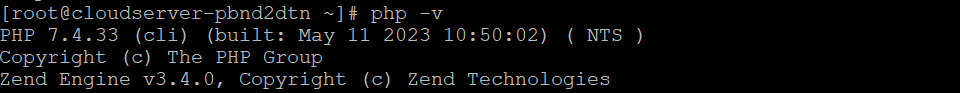

## Introduction

In this article, you will learn how to install PHP 7.4 on AlmaLinux 8.

[PHP](https://en.wikipedia.org/wiki/PHP) is an increasingly popular scripting language that may be used to a variety of different purposes, although it is most commonly utilised in web development. It serves as the fundamental component of the vast majority of blogging platforms, including WordPress, Drupal, Magento, and a great many others.

This tutorial will presume that you have at least a fundamental understanding of Linux, that you are familiar with the shell, and most crucially, that you host your website on a virtual private server (VPS). The installation is really straightforward, although it does make the assumption that you are logged in as the root user. If this is not the case, you may need to add "sudo" to the instructions in order to gain root access.

## Install PHP 7.4 on AlmaLinux 8

**Step 1: First things first, let's check that your machine has the most recent updates installed.**

```
# dnf update

```

**Step 2: Enable the EPEL and Remi repositories, as well as add the EPEL and Remi repositories, on the AlmaLinux system:**

```
# rpm -Uvh https://dl.fedoraproject.org/pub/epel/epel-release-latest-8.noarch.rpm

```


```
# dnf install -y https://rpms.remirepo.net/enterprise/remi-release-8.rpm

```


**Step 3: Installation of PHP 7.4**

**Installing PHP 7.4 using the Remi repository is the next step, and the command to do so is as follows:**

```
# dnf module install php:remi-7.4

```

**After the installation has been completed successfully, we can check the version that was installed by issuing the php -v command:**

```
# php -v

```



## Conclusion

Hopefully, Now you have learned how to install PHP 7.4 on AlmaLinux 8.

**Also Read:** [How to Use Iperf to Test Network Performance](https://utho.com/docs/tutorial/how-to-use-iperf-to-test-network-performance/)

Thank You 🙂
