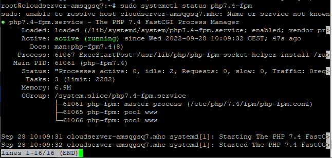

## Introduction

PHP (a made up word for PHP: Hypertext Preprocessor) is an embedded scripting language in [HTML](https://en.wikipedia.org/wiki/HTML) that is widely used due to its flexibility and ease of use in web development, follow the given steps to install PHP 7.4 on Ubuntu 20.04.

## Install Dependencies

In order for PHP to be successfully installed, the following prerequisites will need to be satisfied. Even though the vast majority of these packages are probably already present on your computer, using the command will assist ensure that they are installed.

```
# sudo apt install software-properties-common apt-transport-https -y
```

## Import Ondřej Surý PHP PPA

The first thing that has to be done is to import the well-known PPA that is maintained by Ondrej Sur, who is also in charge of the Ubuntu PPA and is the lead maintainer for PHP on Debian. One of the many great things about the PPA is that in addition to being able to install PHP 7.4, you can also install later versions such as 8.0, 8.1, and eventually 8.2.

Use the following command to import the PPA into your system.

```
# sudo add-apt-repository ppa:ondrej/php -y
```

When you are finished, it is recommended that you update your APT repositories because the PPA may bring further improvements to dependencies that are already installed.

```
# sudo apt upgrade -y
```

## Install Apache with PHP-FPM

The alternative PHP (Hypertext Processor) FastCGI implementation, known as PHP-FPM, which stands for FastCGI Process Manager, has a significant amount of popularity.

To install PHP-FPM with the following commands.

```
# sudo apt install php7.4-fpm libapache2-mod-fcgid -y
```

Verify that PHP-FPM is working:

```
# sudo systemctl status php7.4-fpm
```



Use the following command as a helpful reminder to check, which version of PHP 7.4 is currently installed on your computer system.

```
# php -v
```


## Conclusion

Hopefully now you understand how to install PHP 7.4 on Ubuntu 20.04.

[**Install PHP 7.4 on Debian 10**](https://utho.com/docs/tutorial/how-to-install-php-7-4-on-debian-10/)

Thank You 🙂
