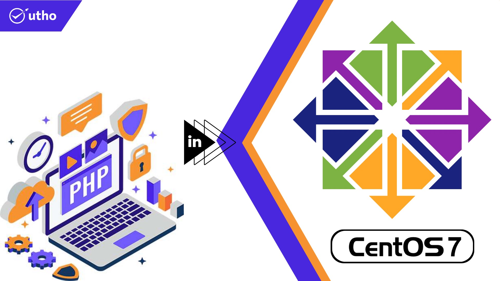
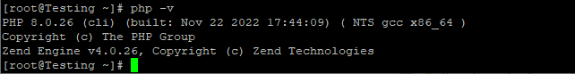

## Introduction

In this article you will learn how to install PHP 8 on [Centos 7](https://utho.com/docs/tutorial/how-to-install-git-on-centos-7/).

[PHP](https://en.wikipedia.org/wiki/PHP) is the most widely used server-side scripting language in the creation of dynamic web pages. PHP applications usually work well with HTML and interact with relational database management systems. Here are the steps to install PHP 8 on CentOS.

PHP is an open-source server-side programming language that may be used to construct a wide range of various things, such as websites, applications, and customer relationship management systems. PHP is a server-side programming language. It is a programming language that may be used for a variety of purposes and is rather popular. Additionally, it can be included into HTML. Because PHP can work with HTML, it has remained one of the most widely used programming languages in the development community. This is due to the fact that PHP contributes to the simplification of the HTML code.

The phrase "PHP: Hypertext Preprocessor" is what the acronym PHP refers to, with the "PHP" in PHP initially standing for "Personal Home Page" inside this abbreviation. Since its creation in 1994, the phrase has gone through a number of modifications in order to provide a more accurate description of the nature of the entity to which it refers.

For nearly three decades, PHP has been a go-to language for web development thanks to its many features and flexibility.

## Add Remi Repository

Remi is a repository managed by a third party that gives CentOS users access to the most recent versions of the PHP rpm packages.

```
# yum install -y https://dl.fedoraproject.org/pub/epel/epel-release-latest-7.noarch.rpm
```

```
# yum install https://rpms.remirepo.net/enterprise/remi-release-7.rpm
```

## Install PHP 8.0

You can install the PHP 8.0 package by utilising the following command, which will first enable the Remi PHP 8.0 repository temporarily.

```
# yum install -y --enablerepo=remi-php80 php php-cli
```

## Check PHP Version

After you have finished installing the PHP package, use the following command to check the version of PHP that you have installed.

```
# php -v
```



## Install PHP Extensions

PHP extensions are pre-compiled libraries that give your code more functionality and support. Installing the PHP MySQL extension, for instance, will make it possible for your PHP code to establish a connection with the MySQL database.

```
# yum install -y --enablerepo=**remi-php80** php-mysqlnd
```

## Conclusion

I hope you have learned how to install PHP 8 on Centos 7.

Thank You 🙂
