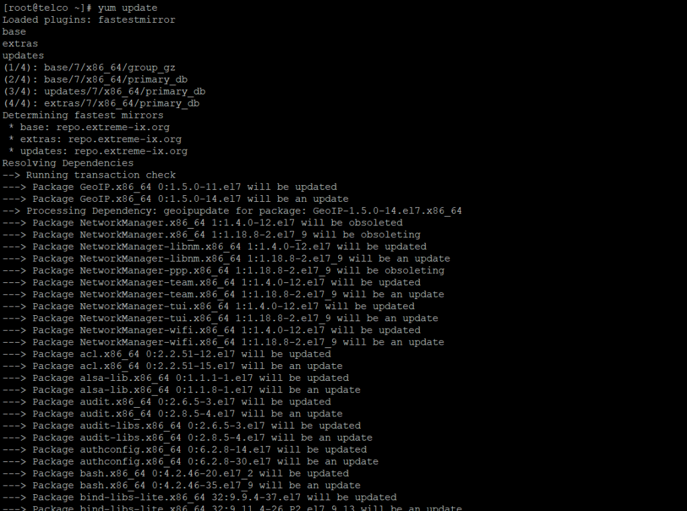
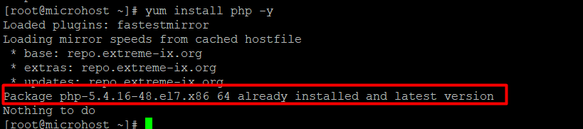

**Description**

On CentOS 7, which will be covered in this tutorial, we will learn how to install [PHP](https://en.wikipedia.org/wiki/PHP) on centos 7. PHP is a popular open-source general-purpose scripting language that is well suited for web development and can be integrated into HTML. PHP can also be thought of as a server-side scripting language. PHP stands for PHP: Hypertext Preprocessor, which is a recursive acronym in and of itself. [PHP](https://utho.com/docs/tutorial/how-to-add-a-user-and-grant-root-privileges-on-centos-7/) is an abbreviation that stands for PHP.

Follow the below steps to learn How to install PHP on CentOS 7

NOTE:- The Apache web server should already be set up.

## Step.1 Update the Linux system

Before proceeding with the installation of the PHP packages, you are required to first bring the operating system up to speed by utilising the yum update command.

```
yum update
```
<figure>



<figcaption>

How to install PHP on CentOS 7

</figcaption>

</figure>

## Step.2 Install PHP

Install PHP by issuing the yum install php instruction at the command prompt.

```
yum install php
```


## Step.3 Check version

After the installation has been completed, you should verify the version of PHP that is currently installed by executing the php version command.

```
php --version
```


I truly wish that each and every one of these things was crystal plain to you, and I really do hope that they were. PHP installation instructions for CentOS 7

Must read:- [https://utho.com/docs/tutorial/find-multiple-ways-to-user-account-info-and-login-details-in-linux/](https://utho.com/docs/tutorial/find-multiple-ways-to-user-account-info-and-login-details-in-linux/)
