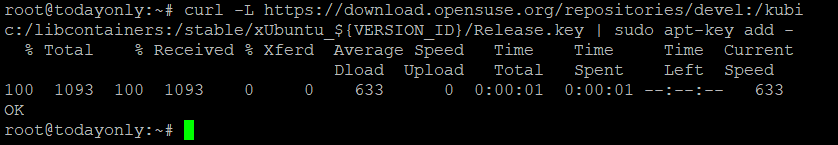

<figure>


<figcaption>

How to Install Podman on Ubuntu 20.04 LTSHow to Install Podman on Ubuntu 20.04 LTS

</figcaption>

</figure>

**Description**

Installing [Podman](https://podman.io/) on Ubuntu 20.04 LTS is the next step, but before we get started, let's see what we can learn about this application. According to the official description, Podman, also known as the Pod Manager Tool, is a daemonless open source container engine that allows us to create, manage, and operate OCI containers on our [Linux](https://utho.com/docs/tutorial/category/linux-tutorial/) system. There is also the option to use the podman utility that is included in the libpod library. As a result of the recent modification to the Docker licence, podman has the potential to become a useful alternative that is compatible with the vast majority of Linux distributions, including the long-term support version of Ubuntu 20.04 LTS.

##  Prerequisites

a) You should already have an Ubuntu 20.04 LTS server up and running.

b) You need access to sudo or root to run commands with special permissions.

b) You need to make sure that the utilities apt-get, curl, and apt-key are installed on your server.

## Source OS Release

First, use the source /etc/os-release command to get the OS release, as shown below.

```
source /etc/os-release
```
## Add Repository

Since podman is not in the default Ubuntu repository, we need to add the Kubic repository to be able to download the podman package. Then it can be installed using one of the package managers in Ubuntu, such as apt or apt-get. To add the repository, use the below command.

```
echo "deb https://download.opensuse.org/repositories/devel:/kubic:/libcontainers:/stable/xUbuntu_${VERSION_ID}/ /" | sudo tee /etc/apt/sources.list.d/devel:kubic:libcontainers:stable.list
```


##  Add GPG Key

Then, use the command below to download and add the GPG key. This is needed to make sure the downloaded package is good.



## Update Server

```
apt-get update
```


## Upgrade Server

```
apt-get -y upgrade
```


## Install Podman

Now, you can use the apt-get -y install podman command, as shown below, to download and install the podman package from the configured repository. This will install the package and everything it needs to work.

```
apt-get -y install podman
```
**Thankyou**
