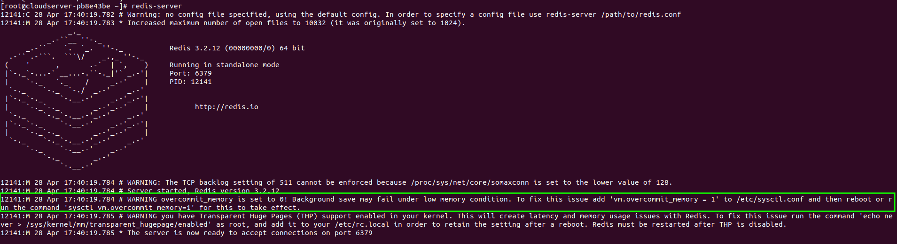

<figure>


<figcaption>

How to install Redis on Fedora

</figcaption>

</figure>

In this article, you will learn how to install and configure Redis on CentOS 7 or 8. [Redis](https://en.wikipedia.org/wiki/Redis) is a data structure that is stored in memory and functions similarly to a store. It can be used as a cache, streaming engine, or database. Redis makes it possible for developers to save data in their programmes using straightforward statements rather than the more complicated query language often required.Redis has support for a wide variety of data structures, including strings, hashes, sets, and many others. In addition to that, it gives you access to the Replication features as well as the Redis cluster, which gives you automatic partitioning.

## Prerequisites

- Any normal user with SUDO privileges or super user
- yum server configured Fedora server

## Steps to install Redis Cache on Fedora

Step 1: To install the Redis package on Fedora you need to use the YUM package manager to add the EPEL repository to your machine, as shown.

```
yum install epel-release
```
Step 2: Once EPEL is set up, you should perform the following to install the Redis package from the source.

```
yum install redis -y
```
Step 3: Now, to verify whether the Redis cache server installed on your Fedora, use the below command

```
#redis-server
```

<figure>



<figcaption>

Successfully installed redis on Fedora

</figcaption>

</figure>

Here, in the screenshot, it is highlighted some line. Once you've installed the package, you'll need to set up your server so that Redis works smoothly. As explained, you need to change some settings in the kernel.

### Optimize the Redis server

Step 4: Next, set the Linux kernel's overcommit memory setting to 1 by adding vm.overcommit\_memory = 1 to the /etc/sysctl.conf setup file.

```
echo "vm.overcommit_memory = 1" >> /etc/sysctl.conf
```
Now, navigate to the line which contains the "vm.overcommit\_memory" and change the value to 1. If this line is not present in the configuration file, just add it in the end of the file.

<figure>


<figcaption>

optimize the redis

</figcaption>

</figure>

Step 5: and then put the change into effect without restarting the system. Run the following command to turn on the setting right away.

```
sysctl vm.overcommit_memory=1
```
<figure>


<figcaption>

changes into effects

</figcaption>

</figure>

Step 6: Also, use the echo command below to make sure that the visible huge pages kernel feature is turned off. This feature has a bad effect on both memory usage and delay.

```
echo never > /sys/kernel/mm/transparent_hugepage/enabled
```

### Configure the Redis on Fedora

Step 7: Then, use any of your favourite text-based tools to open the original Redis setup file and make changes to it as shown.

```
vi /etc/redis.conf
```
There are several setting instructions, and the file explains what they mean and how they should be used.

A common example of setup is letting the Redis server be accessed from outside the network. By default, Redis is set up to only accept calls on the computer where it is running, on the loopback link (127.0.0.1), and it waits on port 6379.

To allow remote access, use the "bind" setup command followed by one or more IP addresses to set it to listen to a single interface or multiple chosen interfaces.

```
bind  127.0.0.1
bind <redis-server-ip> 192.168.2.24
```

Step 8: Change the number of the port command to connect to a new port.

```
port 1234
```


Step 9: Now, start and enable to Redis service to start using the Redis server.

```
systemctl enable --now redis
```
Step 10: Use the [netstat utility](https://utho.com/docs/tutorial/how-to-use-telnet-netstat-and-wireshark-in-windows/) to cross check the whether the redis service is listening on the port we have just mentioned the configuration file

```
netstat -tunlp
```
Step 11: Now, to start listening from the redis client, lets start the redis server using the below command and let it run in backgroud using &

```
redis-server &
```
<figure>


<figcaption>

Run the redis server in backgroud

</figcaption>

</figure>

Step 12: Connect to your redis server.

```
redis-cli           ## If you want to test it in the redis server machine
redis-cli -h <redis-serverip> -p <redis-port      # Connect from remote client
```
<figure>


<figcaption>

Connect to your redis server

</figcaption>

</figure>

In the above screenshot, we have also test the working of the redis server-client setup by setting up the key value pair.

```
set msg "hello, Microhost"  # to set the value
get msg
```
And this is how you will install the Redis cache on Fedora server.
