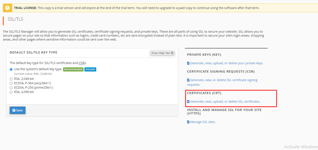

SSL (Secured Sockets Layer) is used to establish  authenticated and encrypted links between network Computers  
Now for  Installing SSL is Server through Cpanel First of allLogin  in cpanel by  SERVER\_IP:2083    
Now login in cpanel and under the Security option select  SSL/TLS option

In the right side of window click on CSR option

After that fill required details and click on Generate option

Now share this file with SSL team they will share one file.

Open the file manager option in cpanel , Now Paste that file under this directory

publc\_html/.well-known/pki-validation/

Note:- If hidden files are Not showing Please follw this step

click on settings option then click on Show hidden files

Now Again Open SSL/TLS option under security and select CERTIFICATES(CRT) option

Now Click on choose file option then upload the Certificate and then click on save Certificate.

SSL is installed on server , Changes will reflect on server with In 2 hrs

Thank you :)
