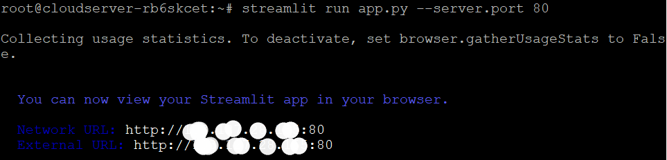

## Introduction

In this article you will learn how to install Streamlit on Ubuntu 22.04.

If you need to create and distribute a data app quickly, Streamlit is your best bet. With [Streamlit](https://streamlit.io/), you can quickly and easily create shared web apps from data scripts. Everything is written in Python. No charge at all. You don't need to have experience in the front end to use this tool. It's a free, public-domain app framework for Machine Learning and Data Science groups. Build stunning data applications in hours, not weeks. Follow these 5 steps to Install Streamlit on Ubuntu 20.04.

##### Step 1. Keep the server updated

**Using the following command, please update the server:**

```
# apt upgrade -y

```

##### Step 2. Install python pip

**The following command will established the Python package manager, pip**:

```
# apt install python3-pip -y

```

##### Step 3. Install Streamlit

**Set up Streamlit with the python pip package manager.**

```
# pip install streamlit

```


##### Step 4. Deploy Streamlit app

**One python file must be created using the following command in order to deploy the Streamlit application:**

```
# vi app.py

```

**To the app.py file, paste the following:**

```
import streamlit as st
st.text_input("Your name", key="name")

```
You can access the value at any point with:
```st.session_state.name
```

**Use the escape:wq key combination to save your work and close the file.**

**You can now deploy the application on port 80 by typing the following command:**

```
# streamlit run app.py --server.port 80

```



**The Streamlit app can be accessed via a web browser by entering the server's IP address.**

##### Step 5. Use Screen

**When you log out of an SSH session, Streamlit will automatically end the session. We need to utilise a screen tool to make it permanent. You can disconnect from the server using a different terminal after you've established a connection in screen. Specifically, a persistence session will be formed.**

```
# streamlit run app.py --server.port 80

```

**Deploy Streamlit app:**

```
# streamlit run app.py --server.port 80

```

**Now disconnect from the server and open a new terminal; from there, use the following command to display information about your current screen experience.**

```
# screen -list

```


We finished the setup procedure and deployed our first app without any problems. I hope you understand now how to install Streamlit on Ubuntu 22.04.

**Read Also**: [How to Use Iperf to Test Network Performance](https://utho.com/docs/tutorial/how-to-use-iperf-to-test-network-performance/)

Thank You 🙂
