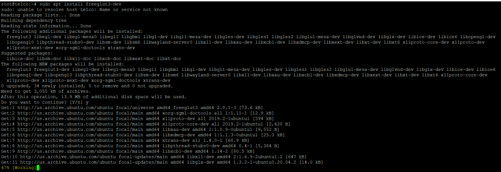
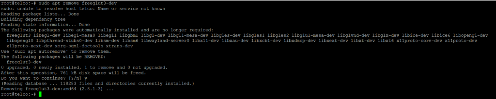

**Description**

In this article, we are going to study How to Install the OpenGL Library on [Ubuntu](https://en.wikipedia.org/wiki/Ubuntu) 20.04 OpenGL is a free, cross-platform API tool for making 2D and 3D graphics that is open source. This API library is made to talk to the graphics processing unit (GPU) so that drawing can be done faster by the hardware. There are many OpenGL tools that can be used for different kinds of graphics. Here are the steps for installing the freeglut OpenGL library on computers that use Ubuntu 20.04 LTS. The OpenGL Utility Toolkit (GLUT) library can also be used with the Freeglut library. Find out more on the page.Please proceed by following the steps below How to Install the OpenGL Library on [Ubuntu](https://utho.com/docs/tutorial/how-to-install-wine-on-ubuntu-20-04/) 20.04.

## Step 1: Update Server

In the first step, use the sudo apt update command to load all the updates from the default Ubuntu repo. In the second step, use the sudo apt upgrade command to update the packages to the latest version, as shown below.

```
sudo apt update && sudo apt upgrade
```


## Step 2: Install OpenGL Library

In the subsequent step, you will use the command sudo apt install freeglut3-dev to install OpenGL Library from the default repository that comes with Ubuntu. This will be demonstrated further down. The program, as well as all of its dependencies, will be downloaded and installed as a result of this action.

```
sudo apt install freeglut3-dev
```


## Step 3: Verify Installation

After the installation has been completed successfully, you can check the installed file path by using the dpkg -L freeglut3-dev command, as is demonstrated below.

```
dpkg -L freeglut3-dev
```


## Step 4: Uninstall OpenGL Library

After you have finished making use of the freeglut library, you have the option of removing it from your computer by using the command sudo apt delete freeglut3-dev, which is displayed below.

**Important**:- Caution is advised while performing the following command, as the removal of this package may, on occasion, have an effect on other applications that are now active.

```
sudo apt remove freeglut3-dev
```


I really hope that you have taken everything into careful consideration to How to Install the OpenGL Library on Ubuntu 20.04

Must Read :- [https://utho.com/docs/tutorial/how-to-install-wine-on-ubuntu-20-04/](https://utho.com/docs/tutorial/how-to-install-wine-on-ubuntu-20-04/)
