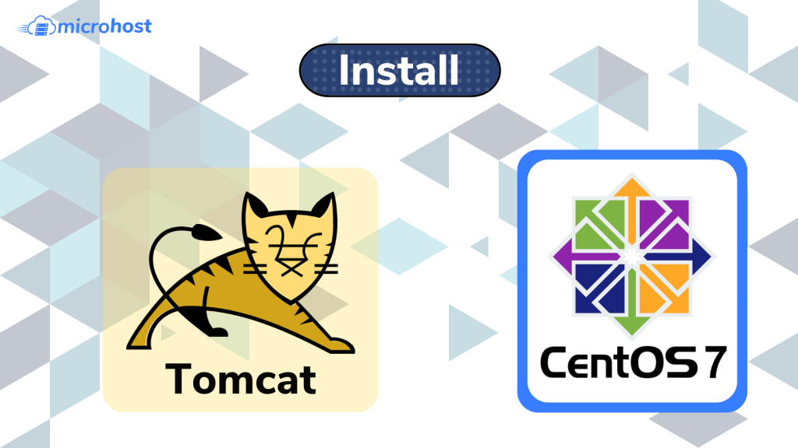
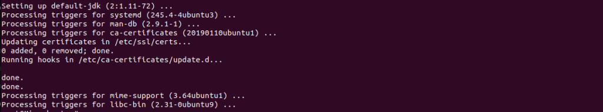

<figure>



<figcaption>

How to install Tomcat 10 on Ubuntu server

</figcaption>

</figure>

## Introduction

This guide will demonstrate how to install Apache Tomcat 10 on Ubuntu server. Install Tomcat 10, configure users and roles, and navigate the administrative user interface.. Java applications are served via Apache Tomcat, a web server and servlet container. It is an open source implementation of the Jakarta Servlet, Jakarta Server Pages, and other Jakarta EE platform technologies.

This guide will demonstrate how to install Apache Tomcat 10 on Ubuntu server. Install Tomcat 10, configure users and roles, and navigate the administrative user interface.

## Prerequisites

- One Ubuntu 20.04 server
- A super user ( root ) or any normal user with SUDO privileges.

```
1 — Installing Tomcat
```
To start, you'll need to get the most recent version and set up a separate user with the right permissions. The Java Development Kit will also be put in (JDK).

For security, Tomcat should run as a separate user who doesn't have any special rights. Run the command below to make a user named tomcat:

```
# useradd -m -d /opt/tomcat -U -s /bin/false tomcat 
```

Option -s is used to set the by default shell `/bin/false` This will ensure that it’s not possible to log in as `tomcat`.

Now install the JDK. To do this first update the package repository.

```
# apt update  
```
# apt install default-jdk
```

```

<figure>



<figcaption>

Output after installing the default-JDK

</figcaption>

</figure>

You can check the java version

```
# java -version 
```

> Output
> 
> openjdk version "11.0.16" 2022-07-19  
> OpenJDK Runtime Environment (build 11.0.16+8-post-Ubuntu-0ubuntu120.04)  
> OpenJDK 64-Bit Server VM (build 11.0.16+8-post-Ubuntu-0ubuntu120.04, mixed mode, sharing)

To install Tomcat, you need the latest Core Linux build for Tomcat 10, which you can get from the [downloads page](https://tomcat.apache.org/download-10.cgi). Choose the most recent version of Core Linux that ends in.tar.gz. At the time of writing, version 10.0.20 was the most recent.

<figure>


<figcaption>

Download page of Tomcat

</figcaption>

</figure>

And now navigate to the `/tmp` directory:

```
# cd /tmp 
```

Download the tomcat version [using wget](https://utho.com/docs/tutorial/download-online-resources-from-the-command-line-with-wget/) and then extract the new downloaded file

```
# wget https://dlcdn.apache.org/tomcat/tomcat-10/v10.0.23/bin/apache-tomcat-10.0.23.tar.gz
```

Now create a new directory in /opt directory with name tomcat and then extract the tomcat files here.  

```
# tar xzvf apache-tomcat-10*tar.gz -C /opt/tomcat --strip-components=1 
```

Since you have already made a user, you can now give tomcat ownership of the extracted installation by running:

```
# chown -R tomcat:tomcat /opt/tomcat/  
```
# chmod -R u+x /opt/tomcat/bin 
```

```

## 2 — Configuring Admin Users

You will set up privileged users in Tomcat's configuration so that they can see the Manager and Host Manager pages. You'll need to get rid of the IP address restrictions, which stop any IP address from the outside from getting to those pages.

The file /opt/tomcat/conf/tomcat-users.xml is where Tomcat users are set up. Use the following command to open the file so it can be changed and append the below content.

```
# vi /opt/tomcat/conf/tomcat-users.xml 
```

```
<role rolename="manager-gui" />
<user username="manager" password="manager_password" roles="manager-gui" />

<role rolename="admin-gui" />
<user username="admin" password="admin_password" roles="manager-gui,admin-gui" />
```

Replace the passwords that are underlined with your own. Save and close the file when you're done.

Here, you set up two user roles, manager-gui and admin-gui, that give each user access to the Manager and Host Manager pages. You also set up roles for two users named manager and admin.

Here, you set up two user roles, manager-gui and admin-gui, that give each user access to the Manager and Host Manager pages. You also set up roles for two users named manager and admin.

Tomcat is set up so that access to the admin pages is limited unless the connection comes from the server itself. You will need to change the config files for those pages so that the users you just made can get to them.

To remove the restriction from the Manager page, you need to edit its config file Comment out the `_**Valve**_` definition, as shown::

```
# /opt/tomcat/webapps/manager/META-INF/context.xml 
```

```
<Context antiResourceLocking="false" privileged="true" >
  <CookieProcessor className="org.apache.tomcat.util.http.Rfc6265CookieProcessor"
                   sameSiteCookies="strict" />
  <!-- <Valve className="org.apache.catalina.valves.RemoteAddrValve" 
         allow="127\.\d+\.\d+\.\d+|::1|0:0:0:0:0:0:0:1" /> -->
  <Manager sessionAttributeValueClassNameFilter="java\.lang\.(?:Boolean|Integer|Long|Number|String)|org\.apache\.catalina\.filters\.CsrfPreventionFilter\$LruCache(?:\$1)?|java\.util\.(?:Linked)?HashMap"/>
</Context>
```

And now repeat for **Host Manager**:

```
# vi /opt/tomcat/webapps/host-manager/META-INF/context.xml 
```

Now that you've set up two users, manager and admin, you can use them to get into parts of the management interface that are normally locked. You will now make a service for Tomcat in systemd.

## 3 — Creating a systemd service

You will now make a systemd service that will keep Tomcat running in the background. In case of an error or failure, the systemd service will also automatically restart Tomcat.

Tomcat is a Java application, so it needs the Java runtime, which you installed in _step 1_ with the JDK. You need to know where Java is before you can run the service. Using the following command, you can find out:

```
# update-java-alternatives -l 
```

> Output:
> 
> java-1.11.0-openjdk-amd64 1111 /usr/lib/jvm/java-1.11.0-openjdk-amd64

In the last column, you can see the path to where Java is. In a moment, you'll need the path to define the service.

Under /etc/systemd/system, you will save the tomcat service in a file called tomcat.service. Make the file editable by doing.

```
# vi /etc/systemd/system/tomcat.service
```

> \[Unit\]  
> Description=Apache Tomcat Web Application Container  
> After=network.target
> 
> \[Service\]  
> Type=forking
> 
> User=tomcat  
> Group=tomcat
> 
> Environment="JAVA\_HOME=/usr/lib/jvm/java-1.11.0-openjdk-amd64"  
> Environment="JAVA\_OPTS=-Djava.security.egd=file:///dev/urandom -Djava.awt.headless=true"
> 
> Environment="CATALINA\_BASE=/opt/tomcat"  
> Environment="CATALINA\_HOME=/opt/tomcat"  
> Environment="CATALINA\_PID=/opt/tomcat/temp/tomcat.pid"  
> Environment="CATALINA\_OPTS=-Xms512M -Xmx1024M -server -XX:+UseParallelGC"
> 
> ExecStart=/opt/tomcat/bin/startup.sh  
> ExecStop=/opt/tomcat/bin/shutdown.sh
> 
> \[Install\]  
> WantedBy=multi-user.target

Change the highlighted JAVA HOME value if it is different from the one you wrote down earlier.

Here, you set up a service that will run Tomcat by running the scripts it provides for starting up and shutting down. You also set a few environment variables to set its home directory (which is still /opt/tomcat) and limit the amount of memory the Java VM can use (in CATALINA OPTS). If the Tomcat service fails, it will automatically start up again.

Save and close the file when you're done.

Reload the systemd daemon so that it knows about the new service:

```
# systemctl daemon-reload 
```

You can then start and enable the Tomcat service by typing:

```
# systemctl start tomcat  
```
# systemctl enable tomcat 
```

```

## 4 — Accessing the Web Interface

Now that the Tomcat service is up and running, you can set up the firewall to let Tomcat accept connections. After that, you'll be able to use its web interface.

Tomcat uses port 8080 to accept HTTP requests. Run the following command to make that port available for traffic:

```
# ufw allow 8080 
```

You can now get to Tomcat by going to your server's IP address in your browser:

```
http://serverip:8080 
```

<figure>


<figcaption>

Tomcat default page after installing on Ubuntu server

</figcaption>

</figure>

And that is how you will install Apache Tomcat 10 on Ubuntu server.
