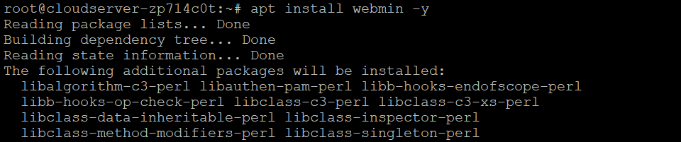

## Introduction

In this article, you will learn how to install Webmin on Debian 12.

[Webmin](https://www.webmin.com/) is a powerful and flexible control panel for the operation of Unix-like servers that is accessed through the web. The user is able to change and control open-source applications such as BIND, Apache HTTP Server, [](https://utho.com/docs/tutorial/how-to-install-php-7-4-in-centos-7/)PHP, or MySQL through the usage of Webmin. Webmin also enables the user to customise the internals of the operating system, such as users, disc quotas, services, or configuration files.

Webmin is mostly constructed on the Perl scripting language and operates as its own process in addition to a web server. It communicates using the TCP port number 10000 by default and may be set up to use SSL if OpenSSL and the extra needed Perl Modules are installed on the system. Webmin is designed around modules, each of which has an interface to the configuration files and the Webmin server. This makes it quite easy to add new functionality to Webmin. Because of the modular architecture of Webmin, it is feasible for anyone who has an interest to build plugins for the setting of desktop environments. Controlling several machines over a single interface is possible with Webmin, as is logging in without interruption to other Webmin servers located on the same local area network (LAN) or subnet.

In the event that a plugin is unavailable for a particular job, it is possible to open a terminal and carry out a variety of operations using a command line interface (CLI). This is especially helpful in situations where it is not possible to utilise SSH or a comparable protocol.

## Installing Webmin

**To begin, if you haven't done so in a while, you should refresh the package index on your server:**

```
# apt update -y

```


**After that, we need to add the Webmin repository in order for our package management to be able to be used to install and update Webmin. In order to accomplish this, we must first add the repository to the /etc/apt/sources.list file.**

```
# vi /etc/apt/sources.list

```

**After that, add the following line to the very end of the file in order to incorporate the new repository:**

```
deb http://download.webmin.com/download/repository sarge contrib
```

**Save the file and exit the editor. If you used vi, do so by pressing escape colon wq.**

**After that, you will need to add the Webmin PGP key so that your operating system will trust the newly created repository. However, in order to achieve that, you will need to install the gnupg1 package. This is the GNU programme for secure communication as well as the storing of sensitive data.**

**After that, you will need to use wget to download the Webmin PGP key, and then you will need to add it to the list of keys on your system:**

```
# wget -q -O- http://www.webmin.com/jcameron-key.asc | sudo apt-key add

```


**Next, make another round of updates to the list of packages in order to incorporate the Webmin repository, which should now be trusted:**

```
# apt update

```

**Install Webmin afterwards:**

```
# apt install webmin -y

```



**Note: If you followed the prerequisite step and installed and enabled ufw, you will need to execute the following command in order to allow Webmin to pass through the firewall:**

```
# ufw allow 10000

```


**The installation of Webmin is finished. You are now able to log in to https://your server:10000 either as root with your root password or as any other user who is able to utilise sudo.**


## Conclusion

Hopefully, you have learned how to install Webmin on Debian 12.

**Also Read:** [How to Use Iperf to Test Network Performance](https://utho.com/docs/tutorial/how-to-use-iperf-to-test-network-performance/)

Thank You 🙂
