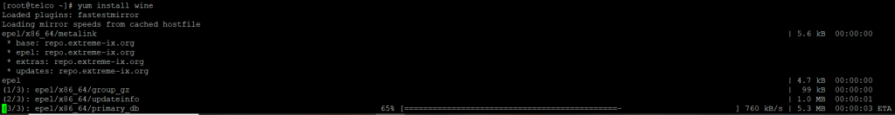

<figure>


<figcaption>

How to install Wine on Alma Linux

</figcaption>

</figure>

In this article we will learn how to install [wine](https://utho.com/docs/tutorial/add-user-and-give-limited-permission-to-the-host-in-zabbix/) on Alma Linux 7 and 8. Starting with the very first step. Wine is a compatibility layer that was developed for multiple [POSIX-based operating systems](https://en.wikipedia.org/wiki/POSIX), such as Linux, Macintosh, and BSD, to enable these systems to run Windows-based software. Wine is available for free and is open source. Wine is a programme that, in its most basic form, automatically translates Windows API calls into POSIX calls. This eliminates the speed and memory penalties that are associated with using other methods and enables you to integrate Windows applications onto your desktop in an uncluttered manner. It is simple to understand and not too difficult to put into practise. Also, the installation process is relatively straightforward in virtually all of the well-known Linux variants.

Step 1: Update your Server

```
yum update
```


## Step 2: Install EPEL Release Repository

You will only be able to obtain the wine package through the EPEL repository. In order to install and activate this repository, you will need to use the yum install epel-release command, as demonstrated further below.

```
yum install epel-release
```


## Step 3: Install Wine package

With the yum install wine command, which will be demonstrated further down, you will be able to install the wine package from the EPEL repository. The package, as well as all of its dependencies, will be downloaded and installed as a result of this action.

```
yum install wine
```


## Step 4: Verify Installation of package

After the installation has been completed successfully, you will be able to validate all of the wine-related packages that have been installed by querying the rpm database using the rpm -qa | grep -i wine command, as will be demonstrated below.

```
rpm -qa | grep -i wine
```


## Step 5: Check Version of package

Using the wine —version command, as seen below, is another option for determining the currently installed version of wine.

```
wine --version
```


I really hope that you've got all of those steps down for how to install [wine](https://utho.com/docs/tutorial/add-user-and-give-limited-permission-to-the-host-in-zabbix/) on Alma Linux
