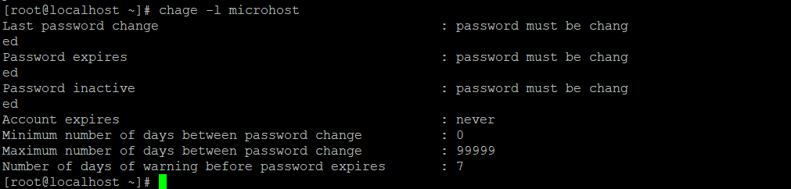

**Description**

Changing the user password expiry information in [Linux](https://www.linux.org/) was the topic of our most recent post, in which we examined many examples of the chage command. If you missed that piece, you can find it here. In this post, we will go over the steps that need to be taken in order to coerce a Linux user into changing their password the next time they log in to their account.

You should be aware that you may also use this approach to compel a user to change their password at their initial login if you have recently created a user account for that user and have set the default password to something else.

There are two different approaches that can be taken to accomplish this, each of which is broken down into more specific steps below.

## Using passwd Command

You can use the passwd command, which is used to change a user's password, to cause a user's password to expire. To do this, specify the -e or —expire switch along with the username as shown in the example above. This will cause the user's password to become invalid, which will then require the user to change his or her password.

```
# passwd --expire microhost 
```

Next, use the chage command to check that the information regarding the user microhost's password expiration and ageing has not changed.

```
# chage -l microhost 
```



You may tell that the user's password needs to be updated by looking at the output of the chage command after you have already executed the passwd command. Before the user microhost is allowed to access a shell, he will be prompted to change his password the next time he tries to log in.

## Using chage Command

You also have the option of using the chage command with the -d or —lastday option, which allows you to choose the number of days that have passed since march 1, 1980, which is the day on which the password was most last altered.

Now, to set the password expiry of the user, run the following command by specifying the day to zero (0). This indicates that the password has not been changed since the above date (i.e., march 1st, 1980), which means that the password has literally become invalid and needs to be changed immediately before the user can access the system again.

```
# chage --lastday 0 microhost 
```

or

```
# chage --lastday 1980-03-01 microhost 
```

Next, examine the details regarding the user ravi's password expiration and ageing with the chage command by using the -l option as shown in the example.

```
# chage -l microhost 
```


**Conclusion**

It is usually suggested that you remind users to update their account passwords on a frequent basis for reasons pertaining to security. This article explains two different approaches that can be taken to require users to alter their passwords at their subsequent login.

Must Read : [Getting Started SELinux](https://utho.com/docs/tutorial/getting-started-with-selinux/)

**Thank You**
