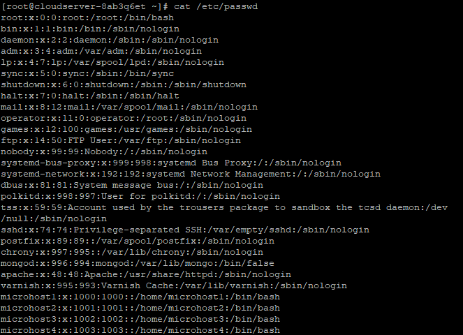

## Introduction

In this article, you will learn how to prevent a user from login in Linux.

The rights that are associated with an account (also known as permissions, user groups, bits, or flags) determine the level of access that a user has to a resource. Access levelling can be either automatic or requested, depending on the situation.

First, using the [useradd](https://pl.wikipedia.org/wiki/Useradd) command, we will create four users and set their passwords using the passwd command.

```
# useradd microhost1
```

```
passwd microhost1
```


Then we do the same things for the next three users, that is, microhost2, microhost3, and microhost4.

We see the users' list from the below command.

```
# cat /etc/passwd
```



If you want to prevent a user from logging in, then you should change the path to /bin/bash to /sbin/nologin

To change the path, use the below command.

```
# vi /etc/passwd
```


To save the file,press escape colon wq.

Then try to login as a microhost1 user and you will see "This account is currently not available".


If you want to login as a microhost1 user, then you would change the path /sbin/nolgin to /bin/bash.

```
# vi /etc/passwd
```


Then try to login as a microhost1 user.

```
# su - microhost1
```


## Conclusion

Hopefully, you have learned how to prevent a user from login in Linux.

Also read: [How to Install Varnish Cache with Apache on CentOS 7](https://utho.com/docs/tutorial/how-to-install-varnish-cache-with-apache-on-centos-7/)

Thank You 🙂
