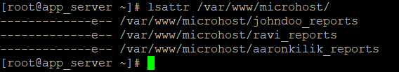
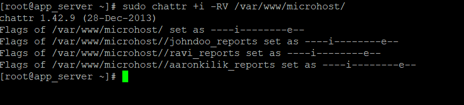

## **Description**

On operating systems that are similar to Unix, such as Linux, the account or user name known as root has the ability to change any and all files and folders on the system by default. In this post, we will demonstrate how to prevent even the root user from deleting directories or files in Linux by using the chmod command.

It is necessary to make a file unmodifiable with the chattr command in order to prevent any user on the system, even root, from being able to delete the file. On a Linux file system, the characteristics of files may be modified with this command.

##### **Make a File Undeletable and See How to Do It**

The following command renders the /var/www/microhost/ file unchangeable (or undeletable). Because of this, it is impossible to make any changes to the file; for example, it cannot be renamed or deleted. You won't even be able to establish a link to it, and you won't be able to add any data to the file either.

Note that in order to change or delete this property using the sudo command, you will need to have the superuser privilege:

```
#sudo chattr +i /var/www/microhost
```

Or

```
#sudo chattr +i -V /var/www/microhost
```


Use the lsattr command as shown here in order to inspect the attributes of a file.



Now, attempt to delete the immutable file using both the standard user account and the root account.

```
#rmdir /var/www/microhost
```

```
#sudo rmdir /var/www/microhost
```


##### **How to Make a Directory Unable to Be Deleted Recursively**

You may make the following changes to the characteristics of directories and their contents in a recursive manner by using the -R switch.



Use the -i sign to delete the attribute mentioned above in order to restore mutability to a file. The steps for doing so are as follows.

```
#sudo chattr -i /var/www/microhost/
```

In this post, we demonstrated how to prevent even the root user on a Linux system from deleting certain files.

#### **Thank You**
